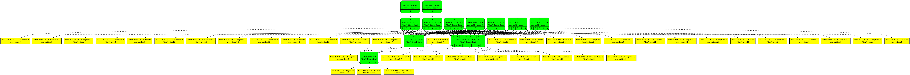
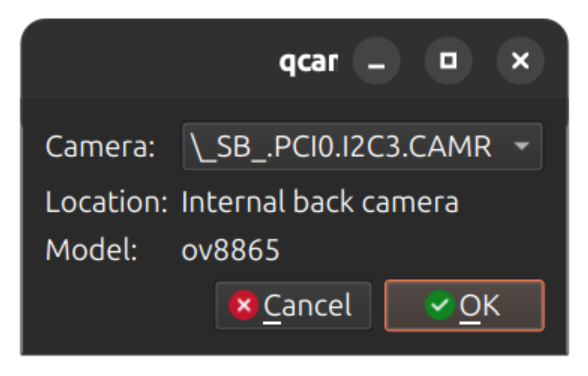

[Discussion](https://github.com/linux-surface/linux-surface/discussions/1353?sort=new) | 
[Wiki](https://github.com/linux-surface/linux-surface/wiki/Camera-Support) | 
[Source](https://github.com/intel/linux-intel-lts/tree/lts-v5.15.195-android_t-251103T063840Z/drivers/media/pci/intel)

# How to build the Linux Kernel

## Requirements

* Ubuntu 26.04
* ~30GB free storage space

## 1. Enable devices in UEFI <sup>[ref](https://learn.microsoft.com/en-us/surface/manage-surface-uefi-settings)</sup>

If you plan to use a device-specific kernel configuration, make sure **all hardware devices are enabled in UEFI**:

1. Power off the device and wait ~10 seconds.
2. Press and hold **Volume Up**, then press and release **Power**.
3. Keep holding **Volume Up** until the UEFI menu appears.
4. Open **Devices** and ensure all devices are enabled.

This step is required for cameras and related controllers to be detected.


## 2. Install required packages

Install build dependencies:

```bash
sudo apt update && \
    sudo apt build-dep -y linux linux-image-unsigned-$(uname -r) && \
    sudo apt install -y fakeroot llvm libncurses-dev dwarves
```

Optional but recommended packages:

```bash
sudo apt install -y git gawk flex bison openssl libssl-dev dkms autoconf \
    libelf-dev libudev-dev libpci-dev libiberty-dev
```

## 3. Clone the ipu4-next repo

```bash
git clone -b main \
    https://github.com/ruslanbay/ipu4-next
```

This repository contains the IPU4 patch set.

## 4. Download the Linux kernel source

```bash
git clone -b v6.19.3 --single-branch --depth=1 \
    https://git.kernel.org/pub/scm/linux/kernel/git/stable/linux.git linux
```

Use the kernel version that matches the patch set.

## 5. Apply patches

```bash
cd linux

git am ../ipu4-next/patches/kernel/v6.19/*.patch
```

## 6. Kernel Configuration

### 6.1. Copy Base Configuration

`cp ../ipu4-next/configs/config-6.19.0-5-generic ./.config`

### 6.2 Set Cryptographic Keys

Clear system trusted and revocation keys in the configuration to prevent common build errors:

```bash
./scripts/config --set-str CONFIG_SYSTEM_TRUSTED_KEYS ""
./scripts/config --set-str CONFIG_SYSTEM_REVOCATION_KEYS ""
```

### 6.3. (Optional) Optimize Build Time

#### 6.3.1 Optimize for the Current Host Only

Optimize the kernel to include only modules enabled on the machine you are building from. The resulting kernel will only work correctly on this specific hardware.

`make localmodconfig`

#### 6.3.2 Disable Debug Packages

Prevent the creation of the large -dbg debug information packages during make bindeb-pkg or make deb-pkg runs.

```bash
# Disable generic debug info flags
./scripts/config --disable DEBUG_INFO
./scripts/config --disable DEBUG_INFO_DWARF_TOOLCHAIN_DEFAULT
./scripts/config --disable DEBUG_INFO_DWARF4
./scripts/config --disable DEBUG_INFO_DWARF5

# Explicitly enable "No Debug Information"
./scripts/config --enable DEBUG_INFO_NONE
```

### 6.4. Enable IPU and Sensor Drivers

```bash
# Intel IPU4 Core & Bridge
./scripts/config --set-str CONFIG_IPU_BRIDGE m
./scripts/config --set-str CONFIG_VIDEO_INTEL_IPU m

# IPU4 Generation & Platform (Booleans)
./scripts/config --enable CONFIG_VIDEO_INTEL_IPU4P
./scripts/config --enable CONFIG_VIDEO_INTEL_IPU_SOC

# Firmware & Power Controller
./scripts/config --set-str CONFIG_VIDEO_INTEL_IPU_FW_LIB m
./scripts/config --set-str CONFIG_INTEL_SKL_INT3472 m
./scripts/config --set-str CONFIG_INTEL_VSC m

# Camera Sensors
./scripts/config --set-str CONFIG_VIDEO_OV5693 m
./scripts/config --set-str CONFIG_VIDEO_OV7251 m
./scripts/config --set-str CONFIG_VIDEO_OV8865 m
./scripts/config --set-str CONFIG_VIDEO_OV9734 m
```

Or you can use `make menuconfig` to enable necessary drivers via the interactive configuration menu:

IPU related options:

```
Device Drivers >
  Multimedia support >
    Media drivers >
	  Media PCI Adapters

<M> Intel IPU Bridge
<M> Intel IPU driver
      intel ipu generation type (Compile for IPU4 driver)
        (X) Compile for IPU4P driver
      intel ipu hardware platform type (Compile for SOC)
        (X) Compile for SOC
<M> Compile firmware library
```

Camera sensors:

```
Device Drivers >
  Multimedia support >
    Media ancillary drivers >
	  Camera sensor devices

<M> OmniVision OV5693 sensor support
<M> OmniVision OV7251 sensor support
<M> OmniVision OV8865 sensor support
<M> OmniVision OV9734 sensor support
```

INT3472 (camera power controller):

```
Device Drivers >
  X86 Platform Specific Device Drivers

<M> Intel SkyLake ACPI INT3472 Driver
```

## 7. Build the kernel

```bash
make clean && \
    make -j$(nproc) bindeb-pkg LOCALVERSION=-surface
```

If the build succeeds, `.deb` packages will appear in the parent directory.

## 8. Install the new kernel

Install all generated packages and reboot:

```bash
sudo apt install ../linux-headers-*.deb ../linux-image-*.deb

sudo reboot
```

## 9. Install IPU4 firmware

Copy firmware blob to `/usr/lib/firmware/ipu4p_cpd.bin`

```
sudo cp ../ipu4-next/firmware/ipu4-20191030.bin /usr/lib/firmware/ipu4p_cpd.bin

sudo reboot
```

|Name|Source|Notes|
|-|-|-|
|[ipu4-20170209.bin](https://media.githubusercontent.com/media/ruslanbay/ipu4-next/refs/heads/main/firmware/ipu4-20170209.bin)|[Intel-5xx-Camera/intel-camera-adaptation](https://github.com/Intel-5xx-Camera/intel-camera-adaptation)|untested, [virustotal](https://www.virustotal.com/gui/file/0a9bf4ea62f1538c43f0ced511778a200f3d08b4c8d0f3c8fbe214d3f3f338d1/details)|
|[ipu4-20180316.bin](https://media.githubusercontent.com/media/ruslanbay/ipu4-next/refs/heads/main/firmware/ipu4-20180316.bin)|[RajmohanMani/ipu4pfw](https://github.com/RajmohanMani/ipu4pfw)|untested, [virustotal](https://www.virustotal.com/gui/file/c3e545014e984237c82ddd55183ae14b242c2ba05d6955f8fa110e8d3dc9759e/details)|
|[ipu4-20190407.bin](https://media.githubusercontent.com/media/ruslanbay/ipu4-next/refs/heads/main/firmware/ipu4-20190407.bin)|[Intel - Camera - 42.17134.3.10471](https://www.catalog.update.microsoft.com/Search.aspx?q=42.17134.3.10471)|untested, [virustotal](https://www.virustotal.com/gui/file/ee534f37f979dfc20e1cb4681bae47c9ec57639f3a2d032b79d77b3097b74d97/details)|
|[ipu4-20191030.bin](https://media.githubusercontent.com/media/ruslanbay/ipu4-next/refs/heads/main/firmware/ipu4-20191030.bin)|[Intel - Camera - 42.18362.3.16827](https://www.catalog.update.microsoft.com/Search.aspx?q=42.18362.3.16827)|works, [virustotal](https://www.virustotal.com/gui/file/ff2c36cc81a5c726508b22970c2e2538ff06107dc5a72c93401403c227e5157f/details)|
|[ipu4-20200609.bin](https://media.githubusercontent.com/media/ruslanbay/ipu4-next/refs/heads/main/firmware/ipu4-20200609.bin)|[intel/ipu4-cam-hal](https://github.com/intel/ipu4-cam-hal/tree/main/IPU_binary/lib/firmware)|untested, [virustotal](https://www.virustotal.com/gui/file/9829f9a592365aa8295e394aa2b350e5e72f818c3e667225b2b31564b3827824/details)|

## 10. Known issues and workarounds

### 10.1. Moduledata and library version mismatch

Issue:

```
journalctl -b | grep -i "ipu"

[    4.074538] intel-ipu4 intel-ipu: Moduledata and library version mismatch (20191030 != 20181222)
[    4.074652] intel-ipu4 intel-ipu: Invalid moduledata
[    4.074713] intel-ipu4 intel-ipu: Failed to validate cpd
[    4.074909] intel-ipu4: probe of intel-ipu failed with error -22
```

Workaround:

```bash
echo "options intel_ipu4p fw_version_check=0" | sudo tee -a /etc/modprobe.d/ipu4.conf

sudo systemctl reboot
```

### 10.2. The `CSE boot_load failed` error

If you encounter "CSE boot_load failed" or timeout errors during boot, it usually indicates the Intel Management Engine (CSE) and the IPU driver are out of sync during the early init phase.

```bash
journalctl -b | grep -i "ipu"

intel-ipu4 intel-ipu: Expect magic number timeout 0xffffffeb
intel-ipu4 intel-ipu: expected resp: 0x1, IPC response: 0x220 
intel-ipu4 intel-ipu: CSE boot_load failed
```

Workaround: Prevent the drivers from initializing automatically at boot to avoid the race condition.

```bash
sudo tee -a /etc/modprobe.d/ipu4.conf <<EOF
blacklist intel_ipu4p
blacklist intel_ipu4p_isys
blacklist intel_ipu4p_psys
blacklist ipu_bridge
blacklist intel_ipu4p_isys_csslib
blacklist intel_ipu4p_psys_csslib
EOF

sudo systemctl reboot
```

Once the system has fully booted and the environment is stable, load the modules manually in the specific order required by the Intel IPU4 driver stack:

```bash
 sudo modprobe ivsc_csi && \
   sudo modprobe ipu_bridge && \
   sudo modprobe intel_ipu4p_isys_csslib && \
   sudo modprobe intel_ipu4p_psys_csslib && \
   sudo modprobe intel_ipu4p && \
   sudo modprobe intel_ipu4p_psys && \
   sudo modprobe intel_ipu4p_isys
```

## 11. Test the IPU4 driver

`media-ctl -d /dev/media0 --print-dot | dot -Tpng > media0-graph.png`



<details>
  <summary>
    <strong>
      journalctl -b | grep -Ei "ipu|ov5693|INT33BE|ov8865|dw9719|INT347"
    </strong>
  </summary>

```
Dec 20 20:20:19 pc kernel: intel-ipu4 intel-ipu: enabling device (0000 -> 0002)
Dec 20 20:20:19 pc kernel: intel-ipu4 intel-ipu: Device 0x8a19 (rev: 0x3)
Dec 20 20:20:19 pc kernel: intel-ipu4 intel-ipu: physical base address 0x6000000000
Dec 20 20:20:19 pc kernel: intel-ipu4 intel-ipu: mapped as: 0x0000000074592112
Dec 20 20:20:19 pc kernel: intel-ipu4 intel-ipu: update security control register failed
Dec 20 20:20:19 pc kernel: intel-ipu4 intel-ipu: Unable to set secure mode!
Dec 20 20:20:19 pc kernel: intel-ipu4 intel-ipu: IPU in secure mode
Dec 20 20:20:19 pc kernel: intel-ipu4 intel-ipu: cpd file name: ipu4p_cpd.bin
Dec 20 20:20:19 pc kernel: intel-ipu4 intel-ipu: Moduledata version: 20191030, library version: 20181222
Dec 20 20:20:19 pc kernel: intel-ipu4 intel-ipu: CSS release: 20181222
Dec 20 20:20:19 pc kernel: acpi INT347A:00: _PLD call failed, using default orientation
Dec 20 20:20:19 pc kernel: intel-ipu4 intel-ipu: Found supported sensor INT347A:00
Dec 20 20:20:19 pc kernel: intel-ipu4 intel-ipu: Connected 1 cameras
Dec 20 20:20:19 pc kernel: intel-ipu4 intel-ipu: IPU driver verion 1.0
Dec 20 20:20:19 pc kernel: intel-ipu4-mmu intel-ipu4-mmu0: MMU: 1, allocated page for trash: 0x0000000080980377
Dec 20 20:20:19 pc kernel: intel-ipu4-mmu intel-ipu4-mmu0: mmu is not ready yet. skipping.
Dec 20 20:20:19 pc kernel: intel-ipu4-mmu intel-ipu4-mmu1: MMU: 0, allocated page for trash: 0x000000004cab7b66
Dec 20 20:20:19 pc kernel: ov8865 i2c-INT347A:00: supply dvdd not found, using dummy regulator
Dec 20 20:20:19 pc kernel: ov8865 i2c-INT347A:00: supply dovdd not found, using dummy regulator
Dec 20 20:20:20 pc kernel: intel-ipu4-mmu intel-ipu4-mmu0: mmu is not ready yet. skipping.
Dec 20 20:20:20 pc kernel: intel-ipu4-mmu intel-ipu4-mmu0: iova trash buffer for MMUID: 1 is 4286578688
Dec 20 20:20:20 pc kernel: intel-ipu4-isys intel-ipu4-isys0: isys probe 000000005b7be633 000000005b7be633
Dec 20 20:20:20 pc kernel: intel-ipu4-isys intel-ipu4-isys0: Entity type for entity Intel IPU4 CSI-2 0 was not initialized!
Dec 20 20:20:20 pc kernel: intel-ipu4-isys intel-ipu4-isys0: Entity type for entity Intel IPU4 CSI-2 1 was not initialized!
Dec 20 20:20:20 pc kernel: intel-ipu4-isys intel-ipu4-isys0: Entity type for entity Intel IPU4 CSI-2 2 was not initialized!
Dec 20 20:20:20 pc kernel: intel-ipu4-isys intel-ipu4-isys0: Entity type for entity Intel IPU4 CSI-2 3 was not initialized!
Dec 20 20:20:20 pc kernel: intel-ipu4-isys intel-ipu4-isys0: Entity type for entity Intel IPU4 CSI-2 4 was not initialized!
Dec 20 20:20:20 pc kernel: intel-ipu4-mmu intel-ipu4-mmu1: mmu is not ready yet. skipping.
Dec 20 20:20:20 pc kernel: intel-ipu4 intel-ipu: Sending BOOT_LOAD to CSE
Dec 20 20:20:20 pc kernel: intel-ipu4-isys intel-ipu4-isys0: Entity type for entity Intel IPU4 CSI2 BE SOC was not initialized!
Dec 20 20:20:20 pc kernel: intel-ipu4-isys intel-ipu4-isys0: Entity type for entity Intel IPU4 CSI2 BE was not initialized!
Dec 20 20:20:20 pc kernel: intel-ipu4-isys intel-ipu4-isys0: Entity type for entity Intel IPU4 ISA was not initialized!
Dec 20 20:20:20 pc kernel: intel-ipu4-isys intel-ipu4-isys0: no subdevice info provided
Dec 20 20:20:20 pc kernel: ov8865 i2c-INT347A:00: Consider updating driver ov8865 to match on endpoints
Dec 20 20:20:20 pc kernel: intel-ipu4-mmu intel-ipu4-mmu1: iova trash buffer for MMUID: 0 is 4286578688
Dec 20 20:20:20 pc kernel: intel-ipu4-psys intel-ipu4-psys0: pkg_dir entry count:12
Dec 20 20:20:25 pc kernel: ov8865 i2c-INT347A:00: Instantiated dw9719 VCM
Dec 20 20:20:25 pc kernel: intel-ipu4-isys intel-ipu4-isys0: FW authentication failed
Dec 20 20:20:25 pc kernel: intel-ipu4 intel-ipu: Sending BOOT_LOAD to CSE
Dec 20 20:20:25 pc kernel: intel-ipu4 intel-ipu: expected resp: 0x1, IPC response: 0x220 
Dec 20 20:20:25 pc kernel: intel-ipu4 intel-ipu: CSE boot_load failed
Dec 20 20:20:25 pc kernel: intel-ipu4-isys intel-ipu4-isys0: FW authentication failed
Dec 20 20:20:25 pc kernel: intel-ipu4 intel-ipu: Sending BOOT_LOAD to CSE
Dec 20 20:20:25 pc kernel: intel-ipu4 intel-ipu: Sending AUTHENTICATE_RUN to CSE
Dec 20 20:20:25 pc kernel: intel-ipu4-psys intel-ipu4-psys0: psys probe minor: 0
Dec 20 20:20:25 pc kernel: dw9719 i2c-INT347A:00-VCM: supply vdd not found, using dummy regulator
```
</details></br>

<details>
  <summary>
    <strong>
      v4l2-ctl --list-devices
    </strong>
  </summary>

```
ipu4p (PCI:pci:intel-ipu):
	/dev/video0
	/dev/video1
	/dev/video2
	/dev/video3
	/dev/video4
	/dev/video5
	/dev/video6
	/dev/video7
	/dev/video8
	/dev/video9
	/dev/video10
	/dev/video11
	/dev/video12
	/dev/video13
	/dev/video14
	/dev/video15
	/dev/video16
	/dev/video17
	/dev/video18
	/dev/video19
	/dev/video20
	/dev/video21
	/dev/video22
	/dev/video23
	/dev/video24
	/dev/video25
	/dev/video26
	/dev/video27
	/dev/video28
	/dev/video29
	/dev/video30
	/dev/video31
	/dev/video32
	/dev/video33
	/dev/video34
	/dev/video35
	/dev/video36
	/dev/video37
	/dev/video38
	/dev/video39
	/dev/video40
	/dev/video41
	/dev/video42
	/dev/video43
	/dev/video44
	/dev/video45
	/dev/video46
	/dev/video47
	/dev/video48
	/dev/video49
	/dev/video50
	/dev/video51
	/dev/video52
	/dev/video53
	/dev/video54

ipu4p (pci:intel-ipu):
	/dev/media0
```
</details></br>

<details>
  <summary>
    <strong>
      modinfo intel_ipu4p
    </strong>
  </summary>

```
filename:       /lib/modules/6.19.2-surface/kernel/drivers/media/pci/intel/ipu4/intel-ipu4p.ko
description:    Intel ipu pci driver
license:        GPL
author:         Intel
author:         Kun Jiang <kun.jiang@intel.com>
author:         Xia Wu <xia.wu@intel.com>
author:         Leifu Zhao <leifu.zhao@intel.com>
author:         Zaikuo Wang <zaikuo.wang@intel.com>
author:         Yunliang Ding <yunliang.ding@intel.com>
author:         Bingbu Cao <bingbu.cao@intel.com>
author:         Renwei Wu <renwei.wu@intel.com>
author:         Tianshu Qiu <tian.shu.qiu@intel.com>
author:         Jianxu Zheng <jian.xu.zheng@intel.com>
author:         Samu Onkalo <samu.onkalo@intel.com>
author:         Antti Laakso <antti.laakso@intel.com>
author:         Jouni Högander <jouni.hogander@intel.com>
author:         Sakari Ailus <sakari.ailus@linux.intel.com>
import_ns:      INTEL_IPU_BRIDGE
description:    Intel ipu mmu driver
license:        GPL
author:         Samu Onkalo <samu.onkalo@intel.com>
author:         Sakari Ailus <sakari.ailus@linux.intel.com>
description:    Intel ipu trace support
license:        GPL
author:         Samu Onkalo <samu.onkalo@intel.com>
description:    Intel ipu fw comm library
license:        GPL
srcversion:     A52AE77D776736253F8AB93
alias:          pci:v00008086d00008A19sv*sd*bc*sc*i*
depends:        ipu-bridge
intree:         Y
name:           intel_ipu4p
retpoline:      Y
vermagic:       6.19.2-surface SMP preempt mod_unload modversions 
sig_id:         PKCS#7
signer:         Build time autogenerated kernel key
sig_key:        ...
sig_hashalgo:   sha512
signature:      ...
parm:           fw_version_check:enable/disable checking firmware version (bool)
parm:           secure_mode_enable:bool
parm:           secure_mode:IPU secure mode enable
```
</details></br>

<details>
  <summary>
    <strong>
      lsmod | grep -Ei "ipu|ov5693|INT33BE|ov8865|dw9719|INT347"
    </strong>
  </summary>

```
dw9719                 16384  1
v4l2_cci               16384  1 dw9719
intel_ipu4p_psys       65536  0
intel_ipu4p_psys_csslib   147456  1 intel_ipu4p_psys
intel_ipu4p_isys      172032  0
videobuf2_dma_contig    24576  1 intel_ipu4p_isys
intel_ipu4p_isys_csslib    65536  1 intel_ipu4p_isys
intel_skl_int3472_tps68470    20480  0
videobuf2_v4l2         32768  1 intel_ipu4p_isys
videobuf2_common       81920  4 videobuf2_dma_contig,videobuf2_v4l2,intel_ipu4p_isys,videobuf2_memops
ov8865                 32768  1
v4l2_fwnode            32768  2 intel_ipu4p_isys,ov8865
v4l2_async             28672  4 v4l2_fwnode,dw9719,intel_ipu4p_isys,ov8865
videodev              286720  6 v4l2_async,videobuf2_v4l2,videobuf2_common,dw9719,intel_ipu4p_isys,ov8865
mc                     77824  7 v4l2_async,videodev,videobuf2_v4l2,videobuf2_common,dw9719,intel_ipu4p_isys,ov8865
intel_skl_int3472_discrete    24576  1
intel_skl_int3472_common    16384  2 intel_skl_int3472_tps68470,intel_skl_int3472_discrete
intel_ipu4p           110592  4 intel_ipu4p_psys,intel_ipu4p_isys
ipu_bridge             20480  2 intel_ipu4p_isys,intel_ipu4p
```
</details></br>

<details>
  <summary>
    <strong>
      media-ctl -p
    </strong>
  </summary>

```
Media controller API version 6.19.2

Media device information
------------------------
driver          intel-ipu4-isys
model           ipu4p
serial          
bus info        pci:intel-ipu
hw revision     0x0
driver version  6.19.2

Device topology
- entity 1: Intel IPU4 CSI-2 0 (6 pads, 42 links, 0 routes)
            type V4L2 subdev subtype Unknown flags 0
            device node name /dev/v4l-subdev0
	pad0: SINK,MUST_CONNECT,0x8
		[stream:0 fmt:SBGGR10_1X10/3264x2448 field:none colorspace:raw]
		<- "ov8865 2-0010":0 [ENABLED]
	pad1: SOURCE
		[stream:0 fmt:SBGGR10_1X10/3264x2448 field:none]
		-> "Intel IPU4 CSI-2 0 capture 0":0 [ENABLED]
		-> "Intel IPU4 CSI2 BE":0 []
		-> "Intel IPU4 CSI2 BE SOC":0 [DYNAMIC]
		-> "Intel IPU4 CSI2 BE SOC":1 [DYNAMIC]
		-> "Intel IPU4 CSI2 BE SOC":2 [DYNAMIC]
		-> "Intel IPU4 CSI2 BE SOC":3 [DYNAMIC]
		-> "Intel IPU4 CSI2 BE SOC":4 [DYNAMIC]
		-> "Intel IPU4 CSI2 BE SOC":5 [DYNAMIC]
		-> "Intel IPU4 CSI2 BE SOC":6 [DYNAMIC]
		-> "Intel IPU4 CSI2 BE SOC":7 [DYNAMIC]
	pad2: SOURCE
		[stream:0 fmt:unknown/0x0]
		-> "Intel IPU4 CSI-2 0 capture 1":0 []
		-> "Intel IPU4 CSI2 BE":0 []
		-> "Intel IPU4 CSI2 BE SOC":0 [DYNAMIC]
		-> "Intel IPU4 CSI2 BE SOC":1 [DYNAMIC]
		-> "Intel IPU4 CSI2 BE SOC":2 [DYNAMIC]
		-> "Intel IPU4 CSI2 BE SOC":3 [DYNAMIC]
		-> "Intel IPU4 CSI2 BE SOC":4 [DYNAMIC]
		-> "Intel IPU4 CSI2 BE SOC":5 [DYNAMIC]
		-> "Intel IPU4 CSI2 BE SOC":6 [DYNAMIC]
		-> "Intel IPU4 CSI2 BE SOC":7 [DYNAMIC]
	pad3: SOURCE
		[stream:0 fmt:unknown/0x0]
		-> "Intel IPU4 CSI-2 0 capture 2":0 []
		-> "Intel IPU4 CSI2 BE":0 []
		-> "Intel IPU4 CSI2 BE SOC":0 [DYNAMIC]
		-> "Intel IPU4 CSI2 BE SOC":1 [DYNAMIC]
		-> "Intel IPU4 CSI2 BE SOC":2 [DYNAMIC]
		-> "Intel IPU4 CSI2 BE SOC":3 [DYNAMIC]
		-> "Intel IPU4 CSI2 BE SOC":4 [DYNAMIC]
		-> "Intel IPU4 CSI2 BE SOC":5 [DYNAMIC]
		-> "Intel IPU4 CSI2 BE SOC":6 [DYNAMIC]
		-> "Intel IPU4 CSI2 BE SOC":7 [DYNAMIC]
	pad4: SOURCE
		[stream:0 fmt:unknown/0x0]
		-> "Intel IPU4 CSI-2 0 capture 3":0 []
		-> "Intel IPU4 CSI2 BE":0 []
		-> "Intel IPU4 CSI2 BE SOC":0 [DYNAMIC]
		-> "Intel IPU4 CSI2 BE SOC":1 [DYNAMIC]
		-> "Intel IPU4 CSI2 BE SOC":2 [DYNAMIC]
		-> "Intel IPU4 CSI2 BE SOC":3 [DYNAMIC]
		-> "Intel IPU4 CSI2 BE SOC":4 [DYNAMIC]
		-> "Intel IPU4 CSI2 BE SOC":5 [DYNAMIC]
		-> "Intel IPU4 CSI2 BE SOC":6 [DYNAMIC]
		-> "Intel IPU4 CSI2 BE SOC":7 [DYNAMIC]
	pad5: SOURCE
		-> "Intel IPU4 CSI-2 0 meta":0 []

- entity 8: Intel IPU4 CSI-2 0 capture 0 (1 pad, 1 link)
            type Node subtype V4L flags 0
            device node name /dev/video0
	pad0: SINK,MUST_CONNECT
		<- "Intel IPU4 CSI-2 0":1 [ENABLED]

- entity 14: Intel IPU4 CSI-2 0 capture 1 (1 pad, 1 link)
             type Node subtype V4L flags 0
             device node name /dev/video1
	pad0: SINK,MUST_CONNECT
		<- "Intel IPU4 CSI-2 0":2 []

- entity 20: Intel IPU4 CSI-2 0 capture 2 (1 pad, 1 link)
             type Node subtype V4L flags 0
             device node name /dev/video2
	pad0: SINK,MUST_CONNECT
		<- "Intel IPU4 CSI-2 0":3 []

- entity 26: Intel IPU4 CSI-2 0 capture 3 (1 pad, 1 link)
             type Node subtype V4L flags 0
             device node name /dev/video3
	pad0: SINK,MUST_CONNECT
		<- "Intel IPU4 CSI-2 0":4 []

- entity 32: Intel IPU4 CSI-2 0 meta (1 pad, 1 link)
             type Node subtype V4L flags 0
             device node name /dev/video4
	pad0: SINK,MUST_CONNECT
		<- "Intel IPU4 CSI-2 0":5 []

- entity 38: Intel IPU4 CSI-2 1 (6 pads, 41 links, 0 routes)
             type V4L2 subdev subtype Unknown flags 0
             device node name /dev/v4l-subdev1
	pad0: SINK,MUST_CONNECT,0x8
		[stream:0 fmt:Y10_1X10/4096x3072 field:none]
	pad1: SOURCE
		[stream:0 fmt:Y10_1X10/4096x3072 field:none]
		-> "Intel IPU4 CSI-2 1 capture 0":0 []
		-> "Intel IPU4 CSI2 BE":0 []
		-> "Intel IPU4 CSI2 BE SOC":0 [DYNAMIC]
		-> "Intel IPU4 CSI2 BE SOC":1 [DYNAMIC]
		-> "Intel IPU4 CSI2 BE SOC":2 [DYNAMIC]
		-> "Intel IPU4 CSI2 BE SOC":3 [DYNAMIC]
		-> "Intel IPU4 CSI2 BE SOC":4 [DYNAMIC]
		-> "Intel IPU4 CSI2 BE SOC":5 [DYNAMIC]
		-> "Intel IPU4 CSI2 BE SOC":6 [DYNAMIC]
		-> "Intel IPU4 CSI2 BE SOC":7 [DYNAMIC]
	pad2: SOURCE
		[stream:0 fmt:unknown/0x0]
		-> "Intel IPU4 CSI-2 1 capture 1":0 []
		-> "Intel IPU4 CSI2 BE":0 []
		-> "Intel IPU4 CSI2 BE SOC":0 [DYNAMIC]
		-> "Intel IPU4 CSI2 BE SOC":1 [DYNAMIC]
		-> "Intel IPU4 CSI2 BE SOC":2 [DYNAMIC]
		-> "Intel IPU4 CSI2 BE SOC":3 [DYNAMIC]
		-> "Intel IPU4 CSI2 BE SOC":4 [DYNAMIC]
		-> "Intel IPU4 CSI2 BE SOC":5 [DYNAMIC]
		-> "Intel IPU4 CSI2 BE SOC":6 [DYNAMIC]
		-> "Intel IPU4 CSI2 BE SOC":7 [DYNAMIC]
	pad3: SOURCE
		[stream:0 fmt:unknown/0x0]
		-> "Intel IPU4 CSI-2 1 capture 2":0 []
		-> "Intel IPU4 CSI2 BE":0 []
		-> "Intel IPU4 CSI2 BE SOC":0 [DYNAMIC]
		-> "Intel IPU4 CSI2 BE SOC":1 [DYNAMIC]
		-> "Intel IPU4 CSI2 BE SOC":2 [DYNAMIC]
		-> "Intel IPU4 CSI2 BE SOC":3 [DYNAMIC]
		-> "Intel IPU4 CSI2 BE SOC":4 [DYNAMIC]
		-> "Intel IPU4 CSI2 BE SOC":5 [DYNAMIC]
		-> "Intel IPU4 CSI2 BE SOC":6 [DYNAMIC]
		-> "Intel IPU4 CSI2 BE SOC":7 [DYNAMIC]
	pad4: SOURCE
		[stream:0 fmt:unknown/0x0]
		-> "Intel IPU4 CSI-2 1 capture 3":0 []
		-> "Intel IPU4 CSI2 BE":0 []
		-> "Intel IPU4 CSI2 BE SOC":0 [DYNAMIC]
		-> "Intel IPU4 CSI2 BE SOC":1 [DYNAMIC]
		-> "Intel IPU4 CSI2 BE SOC":2 [DYNAMIC]
		-> "Intel IPU4 CSI2 BE SOC":3 [DYNAMIC]
		-> "Intel IPU4 CSI2 BE SOC":4 [DYNAMIC]
		-> "Intel IPU4 CSI2 BE SOC":5 [DYNAMIC]
		-> "Intel IPU4 CSI2 BE SOC":6 [DYNAMIC]
		-> "Intel IPU4 CSI2 BE SOC":7 [DYNAMIC]
	pad5: SOURCE
		-> "Intel IPU4 CSI-2 1 meta":0 []

- entity 45: Intel IPU4 CSI-2 1 capture 0 (1 pad, 1 link)
             type Node subtype V4L flags 0
             device node name /dev/video5
	pad0: SINK,MUST_CONNECT
		<- "Intel IPU4 CSI-2 1":1 []

- entity 51: Intel IPU4 CSI-2 1 capture 1 (1 pad, 1 link)
             type Node subtype V4L flags 0
             device node name /dev/video6
	pad0: SINK,MUST_CONNECT
		<- "Intel IPU4 CSI-2 1":2 []

- entity 57: Intel IPU4 CSI-2 1 capture 2 (1 pad, 1 link)
             type Node subtype V4L flags 0
             device node name /dev/video7
	pad0: SINK,MUST_CONNECT
		<- "Intel IPU4 CSI-2 1":3 []

- entity 63: Intel IPU4 CSI-2 1 capture 3 (1 pad, 1 link)
             type Node subtype V4L flags 0
             device node name /dev/video8
	pad0: SINK,MUST_CONNECT
		<- "Intel IPU4 CSI-2 1":4 []

- entity 69: Intel IPU4 CSI-2 1 meta (1 pad, 1 link)
             type Node subtype V4L flags 0
             device node name /dev/video9
	pad0: SINK,MUST_CONNECT
		<- "Intel IPU4 CSI-2 1":5 []

- entity 75: Intel IPU4 CSI-2 2 (6 pads, 42 links, 0 routes)
             type V4L2 subdev subtype Unknown flags 0
             device node name /dev/v4l-subdev2
	pad0: SINK,MUST_CONNECT,0x8
		[stream:0 fmt:Y10_1X10/4096x3072 field:none]
		<- "ov5693 1-0036":0 [ENABLED]
	pad1: SOURCE
		[stream:0 fmt:Y10_1X10/4096x3072 field:none]
		-> "Intel IPU4 CSI-2 2 capture 0":0 [ENABLED]
		-> "Intel IPU4 CSI2 BE":0 []
		-> "Intel IPU4 CSI2 BE SOC":0 [DYNAMIC]
		-> "Intel IPU4 CSI2 BE SOC":1 [DYNAMIC]
		-> "Intel IPU4 CSI2 BE SOC":2 [DYNAMIC]
		-> "Intel IPU4 CSI2 BE SOC":3 [DYNAMIC]
		-> "Intel IPU4 CSI2 BE SOC":4 [DYNAMIC]
		-> "Intel IPU4 CSI2 BE SOC":5 [DYNAMIC]
		-> "Intel IPU4 CSI2 BE SOC":6 [DYNAMIC]
		-> "Intel IPU4 CSI2 BE SOC":7 [DYNAMIC]
	pad2: SOURCE
		[stream:0 fmt:unknown/0x0]
		-> "Intel IPU4 CSI-2 2 capture 1":0 []
		-> "Intel IPU4 CSI2 BE":0 []
		-> "Intel IPU4 CSI2 BE SOC":0 [DYNAMIC]
		-> "Intel IPU4 CSI2 BE SOC":1 [DYNAMIC]
		-> "Intel IPU4 CSI2 BE SOC":2 [DYNAMIC]
		-> "Intel IPU4 CSI2 BE SOC":3 [DYNAMIC]
		-> "Intel IPU4 CSI2 BE SOC":4 [DYNAMIC]
		-> "Intel IPU4 CSI2 BE SOC":5 [DYNAMIC]
		-> "Intel IPU4 CSI2 BE SOC":6 [DYNAMIC]
		-> "Intel IPU4 CSI2 BE SOC":7 [DYNAMIC]
	pad3: SOURCE
		[stream:0 fmt:unknown/0x0]
		-> "Intel IPU4 CSI-2 2 capture 2":0 []
		-> "Intel IPU4 CSI2 BE":0 []
		-> "Intel IPU4 CSI2 BE SOC":0 [DYNAMIC]
		-> "Intel IPU4 CSI2 BE SOC":1 [DYNAMIC]
		-> "Intel IPU4 CSI2 BE SOC":2 [DYNAMIC]
		-> "Intel IPU4 CSI2 BE SOC":3 [DYNAMIC]
		-> "Intel IPU4 CSI2 BE SOC":4 [DYNAMIC]
		-> "Intel IPU4 CSI2 BE SOC":5 [DYNAMIC]
		-> "Intel IPU4 CSI2 BE SOC":6 [DYNAMIC]
		-> "Intel IPU4 CSI2 BE SOC":7 [DYNAMIC]
	pad4: SOURCE
		[stream:0 fmt:unknown/0x0]
		-> "Intel IPU4 CSI-2 2 capture 3":0 []
		-> "Intel IPU4 CSI2 BE":0 []
		-> "Intel IPU4 CSI2 BE SOC":0 [DYNAMIC]
		-> "Intel IPU4 CSI2 BE SOC":1 [DYNAMIC]
		-> "Intel IPU4 CSI2 BE SOC":2 [DYNAMIC]
		-> "Intel IPU4 CSI2 BE SOC":3 [DYNAMIC]
		-> "Intel IPU4 CSI2 BE SOC":4 [DYNAMIC]
		-> "Intel IPU4 CSI2 BE SOC":5 [DYNAMIC]
		-> "Intel IPU4 CSI2 BE SOC":6 [DYNAMIC]
		-> "Intel IPU4 CSI2 BE SOC":7 [DYNAMIC]
	pad5: SOURCE
		-> "Intel IPU4 CSI-2 2 meta":0 []

- entity 82: Intel IPU4 CSI-2 2 capture 0 (1 pad, 1 link)
             type Node subtype V4L flags 0
             device node name /dev/video10
	pad0: SINK,MUST_CONNECT
		<- "Intel IPU4 CSI-2 2":1 [ENABLED]

- entity 88: Intel IPU4 CSI-2 2 capture 1 (1 pad, 1 link)
             type Node subtype V4L flags 0
             device node name /dev/video11
	pad0: SINK,MUST_CONNECT
		<- "Intel IPU4 CSI-2 2":2 []

- entity 94: Intel IPU4 CSI-2 2 capture 2 (1 pad, 1 link)
             type Node subtype V4L flags 0
             device node name /dev/video12
	pad0: SINK,MUST_CONNECT
		<- "Intel IPU4 CSI-2 2":3 []

- entity 100: Intel IPU4 CSI-2 2 capture 3 (1 pad, 1 link)
              type Node subtype V4L flags 0
              device node name /dev/video13
	pad0: SINK,MUST_CONNECT
		<- "Intel IPU4 CSI-2 2":4 []

- entity 106: Intel IPU4 CSI-2 2 meta (1 pad, 1 link)
              type Node subtype V4L flags 0
              device node name /dev/video14
	pad0: SINK,MUST_CONNECT
		<- "Intel IPU4 CSI-2 2":5 []

- entity 112: Intel IPU4 CSI-2 3 (6 pads, 41 links, 0 routes)
              type V4L2 subdev subtype Unknown flags 0
              device node name /dev/v4l-subdev3
	pad0: SINK,MUST_CONNECT,0x8
		[stream:0 fmt:Y10_1X10/4096x3072 field:none]
	pad1: SOURCE
		[stream:0 fmt:Y10_1X10/4096x3072 field:none]
		-> "Intel IPU4 CSI-2 3 capture 0":0 []
		-> "Intel IPU4 CSI2 BE":0 []
		-> "Intel IPU4 CSI2 BE SOC":0 [DYNAMIC]
		-> "Intel IPU4 CSI2 BE SOC":1 [DYNAMIC]
		-> "Intel IPU4 CSI2 BE SOC":2 [DYNAMIC]
		-> "Intel IPU4 CSI2 BE SOC":3 [DYNAMIC]
		-> "Intel IPU4 CSI2 BE SOC":4 [DYNAMIC]
		-> "Intel IPU4 CSI2 BE SOC":5 [DYNAMIC]
		-> "Intel IPU4 CSI2 BE SOC":6 [DYNAMIC]
		-> "Intel IPU4 CSI2 BE SOC":7 [DYNAMIC]
	pad2: SOURCE
		[stream:0 fmt:unknown/0x0]
		-> "Intel IPU4 CSI-2 3 capture 1":0 []
		-> "Intel IPU4 CSI2 BE":0 []
		-> "Intel IPU4 CSI2 BE SOC":0 [DYNAMIC]
		-> "Intel IPU4 CSI2 BE SOC":1 [DYNAMIC]
		-> "Intel IPU4 CSI2 BE SOC":2 [DYNAMIC]
		-> "Intel IPU4 CSI2 BE SOC":3 [DYNAMIC]
		-> "Intel IPU4 CSI2 BE SOC":4 [DYNAMIC]
		-> "Intel IPU4 CSI2 BE SOC":5 [DYNAMIC]
		-> "Intel IPU4 CSI2 BE SOC":6 [DYNAMIC]
		-> "Intel IPU4 CSI2 BE SOC":7 [DYNAMIC]
	pad3: SOURCE
		[stream:0 fmt:unknown/0x0]
		-> "Intel IPU4 CSI-2 3 capture 2":0 []
		-> "Intel IPU4 CSI2 BE":0 []
		-> "Intel IPU4 CSI2 BE SOC":0 [DYNAMIC]
		-> "Intel IPU4 CSI2 BE SOC":1 [DYNAMIC]
		-> "Intel IPU4 CSI2 BE SOC":2 [DYNAMIC]
		-> "Intel IPU4 CSI2 BE SOC":3 [DYNAMIC]
		-> "Intel IPU4 CSI2 BE SOC":4 [DYNAMIC]
		-> "Intel IPU4 CSI2 BE SOC":5 [DYNAMIC]
		-> "Intel IPU4 CSI2 BE SOC":6 [DYNAMIC]
		-> "Intel IPU4 CSI2 BE SOC":7 [DYNAMIC]
	pad4: SOURCE
		[stream:0 fmt:unknown/0x0]
		-> "Intel IPU4 CSI-2 3 capture 3":0 []
		-> "Intel IPU4 CSI2 BE":0 []
		-> "Intel IPU4 CSI2 BE SOC":0 [DYNAMIC]
		-> "Intel IPU4 CSI2 BE SOC":1 [DYNAMIC]
		-> "Intel IPU4 CSI2 BE SOC":2 [DYNAMIC]
		-> "Intel IPU4 CSI2 BE SOC":3 [DYNAMIC]
		-> "Intel IPU4 CSI2 BE SOC":4 [DYNAMIC]
		-> "Intel IPU4 CSI2 BE SOC":5 [DYNAMIC]
		-> "Intel IPU4 CSI2 BE SOC":6 [DYNAMIC]
		-> "Intel IPU4 CSI2 BE SOC":7 [DYNAMIC]
	pad5: SOURCE
		-> "Intel IPU4 CSI-2 3 meta":0 []

- entity 119: Intel IPU4 CSI-2 3 capture 0 (1 pad, 1 link)
              type Node subtype V4L flags 0
              device node name /dev/video15
	pad0: SINK,MUST_CONNECT
		<- "Intel IPU4 CSI-2 3":1 []

- entity 125: Intel IPU4 CSI-2 3 capture 1 (1 pad, 1 link)
              type Node subtype V4L flags 0
              device node name /dev/video16
	pad0: SINK,MUST_CONNECT
		<- "Intel IPU4 CSI-2 3":2 []

- entity 131: Intel IPU4 CSI-2 3 capture 2 (1 pad, 1 link)
              type Node subtype V4L flags 0
              device node name /dev/video17
	pad0: SINK,MUST_CONNECT
		<- "Intel IPU4 CSI-2 3":3 []

- entity 137: Intel IPU4 CSI-2 3 capture 3 (1 pad, 1 link)
              type Node subtype V4L flags 0
              device node name /dev/video18
	pad0: SINK,MUST_CONNECT
		<- "Intel IPU4 CSI-2 3":4 []

- entity 143: Intel IPU4 CSI-2 3 meta (1 pad, 1 link)
              type Node subtype V4L flags 0
              device node name /dev/video19
	pad0: SINK,MUST_CONNECT
		<- "Intel IPU4 CSI-2 3":5 []

- entity 149: Intel IPU4 CSI-2 4 (6 pads, 41 links, 0 routes)
              type V4L2 subdev subtype Unknown flags 0
              device node name /dev/v4l-subdev4
	pad0: SINK,MUST_CONNECT,0x8
		[stream:0 fmt:Y10_1X10/4096x3072 field:none]
	pad1: SOURCE
		[stream:0 fmt:Y10_1X10/4096x3072 field:none]
		-> "Intel IPU4 CSI-2 4 capture 0":0 []
		-> "Intel IPU4 CSI2 BE":0 []
		-> "Intel IPU4 CSI2 BE SOC":0 [DYNAMIC]
		-> "Intel IPU4 CSI2 BE SOC":1 [DYNAMIC]
		-> "Intel IPU4 CSI2 BE SOC":2 [DYNAMIC]
		-> "Intel IPU4 CSI2 BE SOC":3 [DYNAMIC]
		-> "Intel IPU4 CSI2 BE SOC":4 [DYNAMIC]
		-> "Intel IPU4 CSI2 BE SOC":5 [DYNAMIC]
		-> "Intel IPU4 CSI2 BE SOC":6 [DYNAMIC]
		-> "Intel IPU4 CSI2 BE SOC":7 [DYNAMIC]
	pad2: SOURCE
		[stream:0 fmt:unknown/0x0]
		-> "Intel IPU4 CSI-2 4 capture 1":0 []
		-> "Intel IPU4 CSI2 BE":0 []
		-> "Intel IPU4 CSI2 BE SOC":0 [DYNAMIC]
		-> "Intel IPU4 CSI2 BE SOC":1 [DYNAMIC]
		-> "Intel IPU4 CSI2 BE SOC":2 [DYNAMIC]
		-> "Intel IPU4 CSI2 BE SOC":3 [DYNAMIC]
		-> "Intel IPU4 CSI2 BE SOC":4 [DYNAMIC]
		-> "Intel IPU4 CSI2 BE SOC":5 [DYNAMIC]
		-> "Intel IPU4 CSI2 BE SOC":6 [DYNAMIC]
		-> "Intel IPU4 CSI2 BE SOC":7 [DYNAMIC]
	pad3: SOURCE
		[stream:0 fmt:unknown/0x0]
		-> "Intel IPU4 CSI-2 4 capture 2":0 []
		-> "Intel IPU4 CSI2 BE":0 []
		-> "Intel IPU4 CSI2 BE SOC":0 [DYNAMIC]
		-> "Intel IPU4 CSI2 BE SOC":1 [DYNAMIC]
		-> "Intel IPU4 CSI2 BE SOC":2 [DYNAMIC]
		-> "Intel IPU4 CSI2 BE SOC":3 [DYNAMIC]
		-> "Intel IPU4 CSI2 BE SOC":4 [DYNAMIC]
		-> "Intel IPU4 CSI2 BE SOC":5 [DYNAMIC]
		-> "Intel IPU4 CSI2 BE SOC":6 [DYNAMIC]
		-> "Intel IPU4 CSI2 BE SOC":7 [DYNAMIC]
	pad4: SOURCE
		[stream:0 fmt:unknown/0x0]
		-> "Intel IPU4 CSI-2 4 capture 3":0 []
		-> "Intel IPU4 CSI2 BE":0 []
		-> "Intel IPU4 CSI2 BE SOC":0 [DYNAMIC]
		-> "Intel IPU4 CSI2 BE SOC":1 [DYNAMIC]
		-> "Intel IPU4 CSI2 BE SOC":2 [DYNAMIC]
		-> "Intel IPU4 CSI2 BE SOC":3 [DYNAMIC]
		-> "Intel IPU4 CSI2 BE SOC":4 [DYNAMIC]
		-> "Intel IPU4 CSI2 BE SOC":5 [DYNAMIC]
		-> "Intel IPU4 CSI2 BE SOC":6 [DYNAMIC]
		-> "Intel IPU4 CSI2 BE SOC":7 [DYNAMIC]
	pad5: SOURCE
		-> "Intel IPU4 CSI-2 4 meta":0 []

- entity 156: Intel IPU4 CSI-2 4 capture 0 (1 pad, 1 link)
              type Node subtype V4L flags 0
              device node name /dev/video20
	pad0: SINK,MUST_CONNECT
		<- "Intel IPU4 CSI-2 4":1 []

- entity 162: Intel IPU4 CSI-2 4 capture 1 (1 pad, 1 link)
              type Node subtype V4L flags 0
              device node name /dev/video21
	pad0: SINK,MUST_CONNECT
		<- "Intel IPU4 CSI-2 4":2 []

- entity 168: Intel IPU4 CSI-2 4 capture 2 (1 pad, 1 link)
              type Node subtype V4L flags 0
              device node name /dev/video22
	pad0: SINK,MUST_CONNECT
		<- "Intel IPU4 CSI-2 4":3 []

- entity 174: Intel IPU4 CSI-2 4 capture 3 (1 pad, 1 link)
              type Node subtype V4L flags 0
              device node name /dev/video23
	pad0: SINK,MUST_CONNECT
		<- "Intel IPU4 CSI-2 4":4 []

- entity 180: Intel IPU4 CSI-2 4 meta (1 pad, 1 link)
              type Node subtype V4L flags 0
              device node name /dev/video24
	pad0: SINK,MUST_CONNECT
		<- "Intel IPU4 CSI-2 4":5 []

- entity 186: Intel IPU4 CSI-2 5 (6 pads, 41 links, 0 routes)
              type V4L2 subdev subtype Unknown flags 0
              device node name /dev/v4l-subdev5
	pad0: SINK,MUST_CONNECT,0x8
		[stream:0 fmt:Y10_1X10/4096x3072 field:none]
	pad1: SOURCE
		[stream:0 fmt:Y10_1X10/4096x3072 field:none]
		-> "Intel IPU4 CSI-2 5 capture 0":0 []
		-> "Intel IPU4 CSI2 BE":0 []
		-> "Intel IPU4 CSI2 BE SOC":0 [DYNAMIC]
		-> "Intel IPU4 CSI2 BE SOC":1 [DYNAMIC]
		-> "Intel IPU4 CSI2 BE SOC":2 [DYNAMIC]
		-> "Intel IPU4 CSI2 BE SOC":3 [DYNAMIC]
		-> "Intel IPU4 CSI2 BE SOC":4 [DYNAMIC]
		-> "Intel IPU4 CSI2 BE SOC":5 [DYNAMIC]
		-> "Intel IPU4 CSI2 BE SOC":6 [DYNAMIC]
		-> "Intel IPU4 CSI2 BE SOC":7 [DYNAMIC]
	pad2: SOURCE
		[stream:0 fmt:unknown/0x0]
		-> "Intel IPU4 CSI-2 5 capture 1":0 []
		-> "Intel IPU4 CSI2 BE":0 []
		-> "Intel IPU4 CSI2 BE SOC":0 [DYNAMIC]
		-> "Intel IPU4 CSI2 BE SOC":1 [DYNAMIC]
		-> "Intel IPU4 CSI2 BE SOC":2 [DYNAMIC]
		-> "Intel IPU4 CSI2 BE SOC":3 [DYNAMIC]
		-> "Intel IPU4 CSI2 BE SOC":4 [DYNAMIC]
		-> "Intel IPU4 CSI2 BE SOC":5 [DYNAMIC]
		-> "Intel IPU4 CSI2 BE SOC":6 [DYNAMIC]
		-> "Intel IPU4 CSI2 BE SOC":7 [DYNAMIC]
	pad3: SOURCE
		[stream:0 fmt:unknown/0x0]
		-> "Intel IPU4 CSI-2 5 capture 2":0 []
		-> "Intel IPU4 CSI2 BE":0 []
		-> "Intel IPU4 CSI2 BE SOC":0 [DYNAMIC]
		-> "Intel IPU4 CSI2 BE SOC":1 [DYNAMIC]
		-> "Intel IPU4 CSI2 BE SOC":2 [DYNAMIC]
		-> "Intel IPU4 CSI2 BE SOC":3 [DYNAMIC]
		-> "Intel IPU4 CSI2 BE SOC":4 [DYNAMIC]
		-> "Intel IPU4 CSI2 BE SOC":5 [DYNAMIC]
		-> "Intel IPU4 CSI2 BE SOC":6 [DYNAMIC]
		-> "Intel IPU4 CSI2 BE SOC":7 [DYNAMIC]
	pad4: SOURCE
		[stream:0 fmt:unknown/0x0]
		-> "Intel IPU4 CSI-2 5 capture 3":0 []
		-> "Intel IPU4 CSI2 BE":0 []
		-> "Intel IPU4 CSI2 BE SOC":0 [DYNAMIC]
		-> "Intel IPU4 CSI2 BE SOC":1 [DYNAMIC]
		-> "Intel IPU4 CSI2 BE SOC":2 [DYNAMIC]
		-> "Intel IPU4 CSI2 BE SOC":3 [DYNAMIC]
		-> "Intel IPU4 CSI2 BE SOC":4 [DYNAMIC]
		-> "Intel IPU4 CSI2 BE SOC":5 [DYNAMIC]
		-> "Intel IPU4 CSI2 BE SOC":6 [DYNAMIC]
		-> "Intel IPU4 CSI2 BE SOC":7 [DYNAMIC]
	pad5: SOURCE
		-> "Intel IPU4 CSI-2 5 meta":0 []

- entity 193: Intel IPU4 CSI-2 5 capture 0 (1 pad, 1 link)
              type Node subtype V4L flags 0
              device node name /dev/video25
	pad0: SINK,MUST_CONNECT
		<- "Intel IPU4 CSI-2 5":1 []

- entity 199: Intel IPU4 CSI-2 5 capture 1 (1 pad, 1 link)
              type Node subtype V4L flags 0
              device node name /dev/video26
	pad0: SINK,MUST_CONNECT
		<- "Intel IPU4 CSI-2 5":2 []

- entity 205: Intel IPU4 CSI-2 5 capture 2 (1 pad, 1 link)
              type Node subtype V4L flags 0
              device node name /dev/video27
	pad0: SINK,MUST_CONNECT
		<- "Intel IPU4 CSI-2 5":3 []

- entity 211: Intel IPU4 CSI-2 5 capture 3 (1 pad, 1 link)
              type Node subtype V4L flags 0
              device node name /dev/video28
	pad0: SINK,MUST_CONNECT
		<- "Intel IPU4 CSI-2 5":4 []

- entity 217: Intel IPU4 CSI-2 5 meta (1 pad, 1 link)
              type Node subtype V4L flags 0
              device node name /dev/video29
	pad0: SINK,MUST_CONNECT
		<- "Intel IPU4 CSI-2 5":5 []

- entity 223: Intel IPU4 CSI-2 6 (6 pads, 41 links, 0 routes)
              type V4L2 subdev subtype Unknown flags 0
              device node name /dev/v4l-subdev6
	pad0: SINK,MUST_CONNECT,0x8
		[stream:0 fmt:Y10_1X10/4096x3072 field:none]
	pad1: SOURCE
		[stream:0 fmt:Y10_1X10/4096x3072 field:none]
		-> "Intel IPU4 CSI-2 6 capture 0":0 []
		-> "Intel IPU4 CSI2 BE":0 []
		-> "Intel IPU4 CSI2 BE SOC":0 [DYNAMIC]
		-> "Intel IPU4 CSI2 BE SOC":1 [DYNAMIC]
		-> "Intel IPU4 CSI2 BE SOC":2 [DYNAMIC]
		-> "Intel IPU4 CSI2 BE SOC":3 [DYNAMIC]
		-> "Intel IPU4 CSI2 BE SOC":4 [DYNAMIC]
		-> "Intel IPU4 CSI2 BE SOC":5 [DYNAMIC]
		-> "Intel IPU4 CSI2 BE SOC":6 [DYNAMIC]
		-> "Intel IPU4 CSI2 BE SOC":7 [DYNAMIC]
	pad2: SOURCE
		[stream:0 fmt:unknown/0x0]
		-> "Intel IPU4 CSI-2 6 capture 1":0 []
		-> "Intel IPU4 CSI2 BE":0 []
		-> "Intel IPU4 CSI2 BE SOC":0 [DYNAMIC]
		-> "Intel IPU4 CSI2 BE SOC":1 [DYNAMIC]
		-> "Intel IPU4 CSI2 BE SOC":2 [DYNAMIC]
		-> "Intel IPU4 CSI2 BE SOC":3 [DYNAMIC]
		-> "Intel IPU4 CSI2 BE SOC":4 [DYNAMIC]
		-> "Intel IPU4 CSI2 BE SOC":5 [DYNAMIC]
		-> "Intel IPU4 CSI2 BE SOC":6 [DYNAMIC]
		-> "Intel IPU4 CSI2 BE SOC":7 [DYNAMIC]
	pad3: SOURCE
		[stream:0 fmt:unknown/0x0]
		-> "Intel IPU4 CSI-2 6 capture 2":0 []
		-> "Intel IPU4 CSI2 BE":0 []
		-> "Intel IPU4 CSI2 BE SOC":0 [DYNAMIC]
		-> "Intel IPU4 CSI2 BE SOC":1 [DYNAMIC]
		-> "Intel IPU4 CSI2 BE SOC":2 [DYNAMIC]
		-> "Intel IPU4 CSI2 BE SOC":3 [DYNAMIC]
		-> "Intel IPU4 CSI2 BE SOC":4 [DYNAMIC]
		-> "Intel IPU4 CSI2 BE SOC":5 [DYNAMIC]
		-> "Intel IPU4 CSI2 BE SOC":6 [DYNAMIC]
		-> "Intel IPU4 CSI2 BE SOC":7 [DYNAMIC]
	pad4: SOURCE
		[stream:0 fmt:unknown/0x0]
		-> "Intel IPU4 CSI-2 6 capture 3":0 []
		-> "Intel IPU4 CSI2 BE":0 []
		-> "Intel IPU4 CSI2 BE SOC":0 [DYNAMIC]
		-> "Intel IPU4 CSI2 BE SOC":1 [DYNAMIC]
		-> "Intel IPU4 CSI2 BE SOC":2 [DYNAMIC]
		-> "Intel IPU4 CSI2 BE SOC":3 [DYNAMIC]
		-> "Intel IPU4 CSI2 BE SOC":4 [DYNAMIC]
		-> "Intel IPU4 CSI2 BE SOC":5 [DYNAMIC]
		-> "Intel IPU4 CSI2 BE SOC":6 [DYNAMIC]
		-> "Intel IPU4 CSI2 BE SOC":7 [DYNAMIC]
	pad5: SOURCE
		-> "Intel IPU4 CSI-2 6 meta":0 []

- entity 230: Intel IPU4 CSI-2 6 capture 0 (1 pad, 1 link)
              type Node subtype V4L flags 0
              device node name /dev/video30
	pad0: SINK,MUST_CONNECT
		<- "Intel IPU4 CSI-2 6":1 []

- entity 236: Intel IPU4 CSI-2 6 capture 1 (1 pad, 1 link)
              type Node subtype V4L flags 0
              device node name /dev/video31
	pad0: SINK,MUST_CONNECT
		<- "Intel IPU4 CSI-2 6":2 []

- entity 242: Intel IPU4 CSI-2 6 capture 2 (1 pad, 1 link)
              type Node subtype V4L flags 0
              device node name /dev/video32
	pad0: SINK,MUST_CONNECT
		<- "Intel IPU4 CSI-2 6":3 []

- entity 248: Intel IPU4 CSI-2 6 capture 3 (1 pad, 1 link)
              type Node subtype V4L flags 0
              device node name /dev/video33
	pad0: SINK,MUST_CONNECT
		<- "Intel IPU4 CSI-2 6":4 []

- entity 254: Intel IPU4 CSI-2 6 meta (1 pad, 1 link)
              type Node subtype V4L flags 0
              device node name /dev/video34
	pad0: SINK,MUST_CONNECT
		<- "Intel IPU4 CSI-2 6":5 []

- entity 260: Intel IPU4 CSI-2 7 (6 pads, 41 links, 0 routes)
              type V4L2 subdev subtype Unknown flags 0
              device node name /dev/v4l-subdev7
	pad0: SINK,MUST_CONNECT,0x8
		[stream:0 fmt:Y10_1X10/4096x3072 field:none]
	pad1: SOURCE
		[stream:0 fmt:Y10_1X10/4096x3072 field:none]
		-> "Intel IPU4 CSI-2 7 capture 0":0 []
		-> "Intel IPU4 CSI2 BE":0 []
		-> "Intel IPU4 CSI2 BE SOC":0 [DYNAMIC]
		-> "Intel IPU4 CSI2 BE SOC":1 [DYNAMIC]
		-> "Intel IPU4 CSI2 BE SOC":2 [DYNAMIC]
		-> "Intel IPU4 CSI2 BE SOC":3 [DYNAMIC]
		-> "Intel IPU4 CSI2 BE SOC":4 [DYNAMIC]
		-> "Intel IPU4 CSI2 BE SOC":5 [DYNAMIC]
		-> "Intel IPU4 CSI2 BE SOC":6 [DYNAMIC]
		-> "Intel IPU4 CSI2 BE SOC":7 [DYNAMIC]
	pad2: SOURCE
		[stream:0 fmt:unknown/0x0]
		-> "Intel IPU4 CSI-2 7 capture 1":0 []
		-> "Intel IPU4 CSI2 BE":0 []
		-> "Intel IPU4 CSI2 BE SOC":0 [DYNAMIC]
		-> "Intel IPU4 CSI2 BE SOC":1 [DYNAMIC]
		-> "Intel IPU4 CSI2 BE SOC":2 [DYNAMIC]
		-> "Intel IPU4 CSI2 BE SOC":3 [DYNAMIC]
		-> "Intel IPU4 CSI2 BE SOC":4 [DYNAMIC]
		-> "Intel IPU4 CSI2 BE SOC":5 [DYNAMIC]
		-> "Intel IPU4 CSI2 BE SOC":6 [DYNAMIC]
		-> "Intel IPU4 CSI2 BE SOC":7 [DYNAMIC]
	pad3: SOURCE
		[stream:0 fmt:unknown/0x0]
		-> "Intel IPU4 CSI-2 7 capture 2":0 []
		-> "Intel IPU4 CSI2 BE":0 []
		-> "Intel IPU4 CSI2 BE SOC":0 [DYNAMIC]
		-> "Intel IPU4 CSI2 BE SOC":1 [DYNAMIC]
		-> "Intel IPU4 CSI2 BE SOC":2 [DYNAMIC]
		-> "Intel IPU4 CSI2 BE SOC":3 [DYNAMIC]
		-> "Intel IPU4 CSI2 BE SOC":4 [DYNAMIC]
		-> "Intel IPU4 CSI2 BE SOC":5 [DYNAMIC]
		-> "Intel IPU4 CSI2 BE SOC":6 [DYNAMIC]
		-> "Intel IPU4 CSI2 BE SOC":7 [DYNAMIC]
	pad4: SOURCE
		[stream:0 fmt:unknown/0x0]
		-> "Intel IPU4 CSI-2 7 capture 3":0 []
		-> "Intel IPU4 CSI2 BE":0 []
		-> "Intel IPU4 CSI2 BE SOC":0 [DYNAMIC]
		-> "Intel IPU4 CSI2 BE SOC":1 [DYNAMIC]
		-> "Intel IPU4 CSI2 BE SOC":2 [DYNAMIC]
		-> "Intel IPU4 CSI2 BE SOC":3 [DYNAMIC]
		-> "Intel IPU4 CSI2 BE SOC":4 [DYNAMIC]
		-> "Intel IPU4 CSI2 BE SOC":5 [DYNAMIC]
		-> "Intel IPU4 CSI2 BE SOC":6 [DYNAMIC]
		-> "Intel IPU4 CSI2 BE SOC":7 [DYNAMIC]
	pad5: SOURCE
		-> "Intel IPU4 CSI-2 7 meta":0 []

- entity 267: Intel IPU4 CSI-2 7 capture 0 (1 pad, 1 link)
              type Node subtype V4L flags 0
              device node name /dev/video35
	pad0: SINK,MUST_CONNECT
		<- "Intel IPU4 CSI-2 7":1 []

- entity 273: Intel IPU4 CSI-2 7 capture 1 (1 pad, 1 link)
              type Node subtype V4L flags 0
              device node name /dev/video36
	pad0: SINK,MUST_CONNECT
		<- "Intel IPU4 CSI-2 7":2 []

- entity 279: Intel IPU4 CSI-2 7 capture 2 (1 pad, 1 link)
              type Node subtype V4L flags 0
              device node name /dev/video37
	pad0: SINK,MUST_CONNECT
		<- "Intel IPU4 CSI-2 7":3 []

- entity 285: Intel IPU4 CSI-2 7 capture 3 (1 pad, 1 link)
              type Node subtype V4L flags 0
              device node name /dev/video38
	pad0: SINK,MUST_CONNECT
		<- "Intel IPU4 CSI-2 7":4 []

- entity 291: Intel IPU4 CSI-2 7 meta (1 pad, 1 link)
              type Node subtype V4L flags 0
              device node name /dev/video39
	pad0: SINK,MUST_CONNECT
		<- "Intel IPU4 CSI-2 7":5 []

- entity 297: Intel IPU4 TPG 0 (1 pad, 10 links, 0 routes)
              type V4L2 subdev subtype Sensor flags 0
              device node name /dev/v4l-subdev8
	pad0: SOURCE
		[stream:0 fmt:SBGGR8_1X8/4096x3072 field:none]
		-> "Intel IPU4 TPG 0 capture":0 []
		-> "Intel IPU4 CSI2 BE":0 []
		-> "Intel IPU4 CSI2 BE SOC":0 [DYNAMIC]
		-> "Intel IPU4 CSI2 BE SOC":1 [DYNAMIC]
		-> "Intel IPU4 CSI2 BE SOC":2 [DYNAMIC]
		-> "Intel IPU4 CSI2 BE SOC":3 [DYNAMIC]
		-> "Intel IPU4 CSI2 BE SOC":4 [DYNAMIC]
		-> "Intel IPU4 CSI2 BE SOC":5 [DYNAMIC]
		-> "Intel IPU4 CSI2 BE SOC":6 [DYNAMIC]
		-> "Intel IPU4 CSI2 BE SOC":7 [DYNAMIC]

- entity 299: Intel IPU4 TPG 0 capture (1 pad, 1 link)
              type Node subtype V4L flags 0
              device node name /dev/video40
	pad0: SINK,MUST_CONNECT
		<- "Intel IPU4 TPG 0":0 []

- entity 305: Intel IPU4 TPG 1 (1 pad, 10 links, 0 routes)
              type V4L2 subdev subtype Sensor flags 0
              device node name /dev/v4l-subdev9
	pad0: SOURCE
		[stream:0 fmt:SBGGR8_1X8/4096x3072 field:none]
		-> "Intel IPU4 TPG 1 capture":0 []
		-> "Intel IPU4 CSI2 BE":0 []
		-> "Intel IPU4 CSI2 BE SOC":0 [DYNAMIC]
		-> "Intel IPU4 CSI2 BE SOC":1 [DYNAMIC]
		-> "Intel IPU4 CSI2 BE SOC":2 [DYNAMIC]
		-> "Intel IPU4 CSI2 BE SOC":3 [DYNAMIC]
		-> "Intel IPU4 CSI2 BE SOC":4 [DYNAMIC]
		-> "Intel IPU4 CSI2 BE SOC":5 [DYNAMIC]
		-> "Intel IPU4 CSI2 BE SOC":6 [DYNAMIC]
		-> "Intel IPU4 CSI2 BE SOC":7 [DYNAMIC]

- entity 307: Intel IPU4 TPG 1 capture (1 pad, 1 link)
              type Node subtype V4L flags 0
              device node name /dev/video41
	pad0: SINK,MUST_CONNECT
		<- "Intel IPU4 TPG 1":0 []

- entity 313: Intel IPU4 CSI2 BE SOC (16 pads, 280 links, 0 routes)
              type V4L2 subdev subtype Unknown flags 0
              device node name /dev/v4l-subdev10
	pad0: SINK
		[stream:0 fmt:Y10_1X10/4096x3072 field:none]
		<- "Intel IPU4 CSI-2 0":1 [DYNAMIC]
		<- "Intel IPU4 CSI-2 0":2 [DYNAMIC]
		<- "Intel IPU4 CSI-2 0":3 [DYNAMIC]
		<- "Intel IPU4 CSI-2 0":4 [DYNAMIC]
		<- "Intel IPU4 CSI-2 1":1 [DYNAMIC]
		<- "Intel IPU4 CSI-2 1":2 [DYNAMIC]
		<- "Intel IPU4 CSI-2 1":3 [DYNAMIC]
		<- "Intel IPU4 CSI-2 1":4 [DYNAMIC]
		<- "Intel IPU4 CSI-2 2":1 [DYNAMIC]
		<- "Intel IPU4 CSI-2 2":2 [DYNAMIC]
		<- "Intel IPU4 CSI-2 2":3 [DYNAMIC]
		<- "Intel IPU4 CSI-2 2":4 [DYNAMIC]
		<- "Intel IPU4 CSI-2 3":1 [DYNAMIC]
		<- "Intel IPU4 CSI-2 3":2 [DYNAMIC]
		<- "Intel IPU4 CSI-2 3":3 [DYNAMIC]
		<- "Intel IPU4 CSI-2 3":4 [DYNAMIC]
		<- "Intel IPU4 CSI-2 4":1 [DYNAMIC]
		<- "Intel IPU4 CSI-2 4":2 [DYNAMIC]
		<- "Intel IPU4 CSI-2 4":3 [DYNAMIC]
		<- "Intel IPU4 CSI-2 4":4 [DYNAMIC]
		<- "Intel IPU4 CSI-2 5":1 [DYNAMIC]
		<- "Intel IPU4 CSI-2 5":2 [DYNAMIC]
		<- "Intel IPU4 CSI-2 5":3 [DYNAMIC]
		<- "Intel IPU4 CSI-2 5":4 [DYNAMIC]
		<- "Intel IPU4 CSI-2 6":1 [DYNAMIC]
		<- "Intel IPU4 CSI-2 6":2 [DYNAMIC]
		<- "Intel IPU4 CSI-2 6":3 [DYNAMIC]
		<- "Intel IPU4 CSI-2 6":4 [DYNAMIC]
		<- "Intel IPU4 CSI-2 7":1 [DYNAMIC]
		<- "Intel IPU4 CSI-2 7":2 [DYNAMIC]
		<- "Intel IPU4 CSI-2 7":3 [DYNAMIC]
		<- "Intel IPU4 CSI-2 7":4 [DYNAMIC]
		<- "Intel IPU4 TPG 0":0 [DYNAMIC]
		<- "Intel IPU4 TPG 1":0 [DYNAMIC]
	pad1: SINK
		[stream:0 fmt:Y10_1X10/4096x3072 field:none]
		<- "Intel IPU4 CSI-2 0":1 [DYNAMIC]
		<- "Intel IPU4 CSI-2 0":2 [DYNAMIC]
		<- "Intel IPU4 CSI-2 0":3 [DYNAMIC]
		<- "Intel IPU4 CSI-2 0":4 [DYNAMIC]
		<- "Intel IPU4 CSI-2 1":1 [DYNAMIC]
		<- "Intel IPU4 CSI-2 1":2 [DYNAMIC]
		<- "Intel IPU4 CSI-2 1":3 [DYNAMIC]
		<- "Intel IPU4 CSI-2 1":4 [DYNAMIC]
		<- "Intel IPU4 CSI-2 2":1 [DYNAMIC]
		<- "Intel IPU4 CSI-2 2":2 [DYNAMIC]
		<- "Intel IPU4 CSI-2 2":3 [DYNAMIC]
		<- "Intel IPU4 CSI-2 2":4 [DYNAMIC]
		<- "Intel IPU4 CSI-2 3":1 [DYNAMIC]
		<- "Intel IPU4 CSI-2 3":2 [DYNAMIC]
		<- "Intel IPU4 CSI-2 3":3 [DYNAMIC]
		<- "Intel IPU4 CSI-2 3":4 [DYNAMIC]
		<- "Intel IPU4 CSI-2 4":1 [DYNAMIC]
		<- "Intel IPU4 CSI-2 4":2 [DYNAMIC]
		<- "Intel IPU4 CSI-2 4":3 [DYNAMIC]
		<- "Intel IPU4 CSI-2 4":4 [DYNAMIC]
		<- "Intel IPU4 CSI-2 5":1 [DYNAMIC]
		<- "Intel IPU4 CSI-2 5":2 [DYNAMIC]
		<- "Intel IPU4 CSI-2 5":3 [DYNAMIC]
		<- "Intel IPU4 CSI-2 5":4 [DYNAMIC]
		<- "Intel IPU4 CSI-2 6":1 [DYNAMIC]
		<- "Intel IPU4 CSI-2 6":2 [DYNAMIC]
		<- "Intel IPU4 CSI-2 6":3 [DYNAMIC]
		<- "Intel IPU4 CSI-2 6":4 [DYNAMIC]
		<- "Intel IPU4 CSI-2 7":1 [DYNAMIC]
		<- "Intel IPU4 CSI-2 7":2 [DYNAMIC]
		<- "Intel IPU4 CSI-2 7":3 [DYNAMIC]
		<- "Intel IPU4 CSI-2 7":4 [DYNAMIC]
		<- "Intel IPU4 TPG 0":0 [DYNAMIC]
		<- "Intel IPU4 TPG 1":0 [DYNAMIC]
	pad2: SINK
		[stream:0 fmt:Y10_1X10/4096x3072 field:none]
		<- "Intel IPU4 CSI-2 0":1 [DYNAMIC]
		<- "Intel IPU4 CSI-2 0":2 [DYNAMIC]
		<- "Intel IPU4 CSI-2 0":3 [DYNAMIC]
		<- "Intel IPU4 CSI-2 0":4 [DYNAMIC]
		<- "Intel IPU4 CSI-2 1":1 [DYNAMIC]
		<- "Intel IPU4 CSI-2 1":2 [DYNAMIC]
		<- "Intel IPU4 CSI-2 1":3 [DYNAMIC]
		<- "Intel IPU4 CSI-2 1":4 [DYNAMIC]
		<- "Intel IPU4 CSI-2 2":1 [DYNAMIC]
		<- "Intel IPU4 CSI-2 2":2 [DYNAMIC]
		<- "Intel IPU4 CSI-2 2":3 [DYNAMIC]
		<- "Intel IPU4 CSI-2 2":4 [DYNAMIC]
		<- "Intel IPU4 CSI-2 3":1 [DYNAMIC]
		<- "Intel IPU4 CSI-2 3":2 [DYNAMIC]
		<- "Intel IPU4 CSI-2 3":3 [DYNAMIC]
		<- "Intel IPU4 CSI-2 3":4 [DYNAMIC]
		<- "Intel IPU4 CSI-2 4":1 [DYNAMIC]
		<- "Intel IPU4 CSI-2 4":2 [DYNAMIC]
		<- "Intel IPU4 CSI-2 4":3 [DYNAMIC]
		<- "Intel IPU4 CSI-2 4":4 [DYNAMIC]
		<- "Intel IPU4 CSI-2 5":1 [DYNAMIC]
		<- "Intel IPU4 CSI-2 5":2 [DYNAMIC]
		<- "Intel IPU4 CSI-2 5":3 [DYNAMIC]
		<- "Intel IPU4 CSI-2 5":4 [DYNAMIC]
		<- "Intel IPU4 CSI-2 6":1 [DYNAMIC]
		<- "Intel IPU4 CSI-2 6":2 [DYNAMIC]
		<- "Intel IPU4 CSI-2 6":3 [DYNAMIC]
		<- "Intel IPU4 CSI-2 6":4 [DYNAMIC]
		<- "Intel IPU4 CSI-2 7":1 [DYNAMIC]
		<- "Intel IPU4 CSI-2 7":2 [DYNAMIC]
		<- "Intel IPU4 CSI-2 7":3 [DYNAMIC]
		<- "Intel IPU4 CSI-2 7":4 [DYNAMIC]
		<- "Intel IPU4 TPG 0":0 [DYNAMIC]
		<- "Intel IPU4 TPG 1":0 [DYNAMIC]
	pad3: SINK
		[stream:0 fmt:Y10_1X10/4096x3072 field:none]
		<- "Intel IPU4 CSI-2 0":1 [DYNAMIC]
		<- "Intel IPU4 CSI-2 0":2 [DYNAMIC]
		<- "Intel IPU4 CSI-2 0":3 [DYNAMIC]
		<- "Intel IPU4 CSI-2 0":4 [DYNAMIC]
		<- "Intel IPU4 CSI-2 1":1 [DYNAMIC]
		<- "Intel IPU4 CSI-2 1":2 [DYNAMIC]
		<- "Intel IPU4 CSI-2 1":3 [DYNAMIC]
		<- "Intel IPU4 CSI-2 1":4 [DYNAMIC]
		<- "Intel IPU4 CSI-2 2":1 [DYNAMIC]
		<- "Intel IPU4 CSI-2 2":2 [DYNAMIC]
		<- "Intel IPU4 CSI-2 2":3 [DYNAMIC]
		<- "Intel IPU4 CSI-2 2":4 [DYNAMIC]
		<- "Intel IPU4 CSI-2 3":1 [DYNAMIC]
		<- "Intel IPU4 CSI-2 3":2 [DYNAMIC]
		<- "Intel IPU4 CSI-2 3":3 [DYNAMIC]
		<- "Intel IPU4 CSI-2 3":4 [DYNAMIC]
		<- "Intel IPU4 CSI-2 4":1 [DYNAMIC]
		<- "Intel IPU4 CSI-2 4":2 [DYNAMIC]
		<- "Intel IPU4 CSI-2 4":3 [DYNAMIC]
		<- "Intel IPU4 CSI-2 4":4 [DYNAMIC]
		<- "Intel IPU4 CSI-2 5":1 [DYNAMIC]
		<- "Intel IPU4 CSI-2 5":2 [DYNAMIC]
		<- "Intel IPU4 CSI-2 5":3 [DYNAMIC]
		<- "Intel IPU4 CSI-2 5":4 [DYNAMIC]
		<- "Intel IPU4 CSI-2 6":1 [DYNAMIC]
		<- "Intel IPU4 CSI-2 6":2 [DYNAMIC]
		<- "Intel IPU4 CSI-2 6":3 [DYNAMIC]
		<- "Intel IPU4 CSI-2 6":4 [DYNAMIC]
		<- "Intel IPU4 CSI-2 7":1 [DYNAMIC]
		<- "Intel IPU4 CSI-2 7":2 [DYNAMIC]
		<- "Intel IPU4 CSI-2 7":3 [DYNAMIC]
		<- "Intel IPU4 CSI-2 7":4 [DYNAMIC]
		<- "Intel IPU4 TPG 0":0 [DYNAMIC]
		<- "Intel IPU4 TPG 1":0 [DYNAMIC]
	pad4: SINK
		[stream:0 fmt:Y10_1X10/4096x3072 field:none]
		<- "Intel IPU4 CSI-2 0":1 [DYNAMIC]
		<- "Intel IPU4 CSI-2 0":2 [DYNAMIC]
		<- "Intel IPU4 CSI-2 0":3 [DYNAMIC]
		<- "Intel IPU4 CSI-2 0":4 [DYNAMIC]
		<- "Intel IPU4 CSI-2 1":1 [DYNAMIC]
		<- "Intel IPU4 CSI-2 1":2 [DYNAMIC]
		<- "Intel IPU4 CSI-2 1":3 [DYNAMIC]
		<- "Intel IPU4 CSI-2 1":4 [DYNAMIC]
		<- "Intel IPU4 CSI-2 2":1 [DYNAMIC]
		<- "Intel IPU4 CSI-2 2":2 [DYNAMIC]
		<- "Intel IPU4 CSI-2 2":3 [DYNAMIC]
		<- "Intel IPU4 CSI-2 2":4 [DYNAMIC]
		<- "Intel IPU4 CSI-2 3":1 [DYNAMIC]
		<- "Intel IPU4 CSI-2 3":2 [DYNAMIC]
		<- "Intel IPU4 CSI-2 3":3 [DYNAMIC]
		<- "Intel IPU4 CSI-2 3":4 [DYNAMIC]
		<- "Intel IPU4 CSI-2 4":1 [DYNAMIC]
		<- "Intel IPU4 CSI-2 4":2 [DYNAMIC]
		<- "Intel IPU4 CSI-2 4":3 [DYNAMIC]
		<- "Intel IPU4 CSI-2 4":4 [DYNAMIC]
		<- "Intel IPU4 CSI-2 5":1 [DYNAMIC]
		<- "Intel IPU4 CSI-2 5":2 [DYNAMIC]
		<- "Intel IPU4 CSI-2 5":3 [DYNAMIC]
		<- "Intel IPU4 CSI-2 5":4 [DYNAMIC]
		<- "Intel IPU4 CSI-2 6":1 [DYNAMIC]
		<- "Intel IPU4 CSI-2 6":2 [DYNAMIC]
		<- "Intel IPU4 CSI-2 6":3 [DYNAMIC]
		<- "Intel IPU4 CSI-2 6":4 [DYNAMIC]
		<- "Intel IPU4 CSI-2 7":1 [DYNAMIC]
		<- "Intel IPU4 CSI-2 7":2 [DYNAMIC]
		<- "Intel IPU4 CSI-2 7":3 [DYNAMIC]
		<- "Intel IPU4 CSI-2 7":4 [DYNAMIC]
		<- "Intel IPU4 TPG 0":0 [DYNAMIC]
		<- "Intel IPU4 TPG 1":0 [DYNAMIC]
	pad5: SINK
		[stream:0 fmt:Y10_1X10/4096x3072 field:none]
		<- "Intel IPU4 CSI-2 0":1 [DYNAMIC]
		<- "Intel IPU4 CSI-2 0":2 [DYNAMIC]
		<- "Intel IPU4 CSI-2 0":3 [DYNAMIC]
		<- "Intel IPU4 CSI-2 0":4 [DYNAMIC]
		<- "Intel IPU4 CSI-2 1":1 [DYNAMIC]
		<- "Intel IPU4 CSI-2 1":2 [DYNAMIC]
		<- "Intel IPU4 CSI-2 1":3 [DYNAMIC]
		<- "Intel IPU4 CSI-2 1":4 [DYNAMIC]
		<- "Intel IPU4 CSI-2 2":1 [DYNAMIC]
		<- "Intel IPU4 CSI-2 2":2 [DYNAMIC]
		<- "Intel IPU4 CSI-2 2":3 [DYNAMIC]
		<- "Intel IPU4 CSI-2 2":4 [DYNAMIC]
		<- "Intel IPU4 CSI-2 3":1 [DYNAMIC]
		<- "Intel IPU4 CSI-2 3":2 [DYNAMIC]
		<- "Intel IPU4 CSI-2 3":3 [DYNAMIC]
		<- "Intel IPU4 CSI-2 3":4 [DYNAMIC]
		<- "Intel IPU4 CSI-2 4":1 [DYNAMIC]
		<- "Intel IPU4 CSI-2 4":2 [DYNAMIC]
		<- "Intel IPU4 CSI-2 4":3 [DYNAMIC]
		<- "Intel IPU4 CSI-2 4":4 [DYNAMIC]
		<- "Intel IPU4 CSI-2 5":1 [DYNAMIC]
		<- "Intel IPU4 CSI-2 5":2 [DYNAMIC]
		<- "Intel IPU4 CSI-2 5":3 [DYNAMIC]
		<- "Intel IPU4 CSI-2 5":4 [DYNAMIC]
		<- "Intel IPU4 CSI-2 6":1 [DYNAMIC]
		<- "Intel IPU4 CSI-2 6":2 [DYNAMIC]
		<- "Intel IPU4 CSI-2 6":3 [DYNAMIC]
		<- "Intel IPU4 CSI-2 6":4 [DYNAMIC]
		<- "Intel IPU4 CSI-2 7":1 [DYNAMIC]
		<- "Intel IPU4 CSI-2 7":2 [DYNAMIC]
		<- "Intel IPU4 CSI-2 7":3 [DYNAMIC]
		<- "Intel IPU4 CSI-2 7":4 [DYNAMIC]
		<- "Intel IPU4 TPG 0":0 [DYNAMIC]
		<- "Intel IPU4 TPG 1":0 [DYNAMIC]
	pad6: SINK
		[stream:0 fmt:Y10_1X10/4096x3072 field:none]
		<- "Intel IPU4 CSI-2 0":1 [DYNAMIC]
		<- "Intel IPU4 CSI-2 0":2 [DYNAMIC]
		<- "Intel IPU4 CSI-2 0":3 [DYNAMIC]
		<- "Intel IPU4 CSI-2 0":4 [DYNAMIC]
		<- "Intel IPU4 CSI-2 1":1 [DYNAMIC]
		<- "Intel IPU4 CSI-2 1":2 [DYNAMIC]
		<- "Intel IPU4 CSI-2 1":3 [DYNAMIC]
		<- "Intel IPU4 CSI-2 1":4 [DYNAMIC]
		<- "Intel IPU4 CSI-2 2":1 [DYNAMIC]
		<- "Intel IPU4 CSI-2 2":2 [DYNAMIC]
		<- "Intel IPU4 CSI-2 2":3 [DYNAMIC]
		<- "Intel IPU4 CSI-2 2":4 [DYNAMIC]
		<- "Intel IPU4 CSI-2 3":1 [DYNAMIC]
		<- "Intel IPU4 CSI-2 3":2 [DYNAMIC]
		<- "Intel IPU4 CSI-2 3":3 [DYNAMIC]
		<- "Intel IPU4 CSI-2 3":4 [DYNAMIC]
		<- "Intel IPU4 CSI-2 4":1 [DYNAMIC]
		<- "Intel IPU4 CSI-2 4":2 [DYNAMIC]
		<- "Intel IPU4 CSI-2 4":3 [DYNAMIC]
		<- "Intel IPU4 CSI-2 4":4 [DYNAMIC]
		<- "Intel IPU4 CSI-2 5":1 [DYNAMIC]
		<- "Intel IPU4 CSI-2 5":2 [DYNAMIC]
		<- "Intel IPU4 CSI-2 5":3 [DYNAMIC]
		<- "Intel IPU4 CSI-2 5":4 [DYNAMIC]
		<- "Intel IPU4 CSI-2 6":1 [DYNAMIC]
		<- "Intel IPU4 CSI-2 6":2 [DYNAMIC]
		<- "Intel IPU4 CSI-2 6":3 [DYNAMIC]
		<- "Intel IPU4 CSI-2 6":4 [DYNAMIC]
		<- "Intel IPU4 CSI-2 7":1 [DYNAMIC]
		<- "Intel IPU4 CSI-2 7":2 [DYNAMIC]
		<- "Intel IPU4 CSI-2 7":3 [DYNAMIC]
		<- "Intel IPU4 CSI-2 7":4 [DYNAMIC]
		<- "Intel IPU4 TPG 0":0 [DYNAMIC]
		<- "Intel IPU4 TPG 1":0 [DYNAMIC]
	pad7: SINK
		[stream:0 fmt:Y10_1X10/4096x3072 field:none]
		<- "Intel IPU4 CSI-2 0":1 [DYNAMIC]
		<- "Intel IPU4 CSI-2 0":2 [DYNAMIC]
		<- "Intel IPU4 CSI-2 0":3 [DYNAMIC]
		<- "Intel IPU4 CSI-2 0":4 [DYNAMIC]
		<- "Intel IPU4 CSI-2 1":1 [DYNAMIC]
		<- "Intel IPU4 CSI-2 1":2 [DYNAMIC]
		<- "Intel IPU4 CSI-2 1":3 [DYNAMIC]
		<- "Intel IPU4 CSI-2 1":4 [DYNAMIC]
		<- "Intel IPU4 CSI-2 2":1 [DYNAMIC]
		<- "Intel IPU4 CSI-2 2":2 [DYNAMIC]
		<- "Intel IPU4 CSI-2 2":3 [DYNAMIC]
		<- "Intel IPU4 CSI-2 2":4 [DYNAMIC]
		<- "Intel IPU4 CSI-2 3":1 [DYNAMIC]
		<- "Intel IPU4 CSI-2 3":2 [DYNAMIC]
		<- "Intel IPU4 CSI-2 3":3 [DYNAMIC]
		<- "Intel IPU4 CSI-2 3":4 [DYNAMIC]
		<- "Intel IPU4 CSI-2 4":1 [DYNAMIC]
		<- "Intel IPU4 CSI-2 4":2 [DYNAMIC]
		<- "Intel IPU4 CSI-2 4":3 [DYNAMIC]
		<- "Intel IPU4 CSI-2 4":4 [DYNAMIC]
		<- "Intel IPU4 CSI-2 5":1 [DYNAMIC]
		<- "Intel IPU4 CSI-2 5":2 [DYNAMIC]
		<- "Intel IPU4 CSI-2 5":3 [DYNAMIC]
		<- "Intel IPU4 CSI-2 5":4 [DYNAMIC]
		<- "Intel IPU4 CSI-2 6":1 [DYNAMIC]
		<- "Intel IPU4 CSI-2 6":2 [DYNAMIC]
		<- "Intel IPU4 CSI-2 6":3 [DYNAMIC]
		<- "Intel IPU4 CSI-2 6":4 [DYNAMIC]
		<- "Intel IPU4 CSI-2 7":1 [DYNAMIC]
		<- "Intel IPU4 CSI-2 7":2 [DYNAMIC]
		<- "Intel IPU4 CSI-2 7":3 [DYNAMIC]
		<- "Intel IPU4 CSI-2 7":4 [DYNAMIC]
		<- "Intel IPU4 TPG 0":0 [DYNAMIC]
		<- "Intel IPU4 TPG 1":0 [DYNAMIC]
	pad8: SOURCE
		[stream:0 fmt:unknown/0x0
		 crop:(0,0)/0x0]
		-> "Intel IPU4 BE SOC capture 0":0 [DYNAMIC]
	pad9: SOURCE
		[stream:0 fmt:unknown/0x0
		 crop:(0,0)/0x0]
		-> "Intel IPU4 BE SOC capture 1":0 [DYNAMIC]
	pad10: SOURCE
		[stream:0 fmt:unknown/0x0
		 crop:(0,0)/0x0]
		-> "Intel IPU4 BE SOC capture 2":0 [DYNAMIC]
	pad11: SOURCE
		[stream:0 fmt:unknown/0x0
		 crop:(0,0)/0x0]
		-> "Intel IPU4 BE SOC capture 3":0 [DYNAMIC]
	pad12: SOURCE
		[stream:0 fmt:unknown/0x0
		 crop:(0,0)/0x0]
		-> "Intel IPU4 BE SOC capture 4":0 [DYNAMIC]
	pad13: SOURCE
		[stream:0 fmt:unknown/0x0
		 crop:(0,0)/0x0]
		-> "Intel IPU4 BE SOC capture 5":0 [DYNAMIC]
	pad14: SOURCE
		[stream:0 fmt:unknown/0x0
		 crop:(0,0)/0x0]
		-> "Intel IPU4 BE SOC capture 6":0 [DYNAMIC]
	pad15: SOURCE
		[stream:0 fmt:unknown/0x0
		 crop:(0,0)/0x0]
		-> "Intel IPU4 BE SOC capture 7":0 [DYNAMIC]

- entity 330: Intel IPU4 BE SOC capture 0 (1 pad, 1 link)
              type Node subtype V4L flags 0
              device node name /dev/video42
	pad0: SINK,MUST_CONNECT
		<- "Intel IPU4 CSI2 BE SOC":8 [DYNAMIC]

- entity 336: Intel IPU4 BE SOC capture 1 (1 pad, 1 link)
              type Node subtype V4L flags 0
              device node name /dev/video43
	pad0: SINK,MUST_CONNECT
		<- "Intel IPU4 CSI2 BE SOC":9 [DYNAMIC]

- entity 342: Intel IPU4 BE SOC capture 2 (1 pad, 1 link)
              type Node subtype V4L flags 0
              device node name /dev/video44
	pad0: SINK,MUST_CONNECT
		<- "Intel IPU4 CSI2 BE SOC":10 [DYNAMIC]

- entity 348: Intel IPU4 BE SOC capture 3 (1 pad, 1 link)
              type Node subtype V4L flags 0
              device node name /dev/video45
	pad0: SINK,MUST_CONNECT
		<- "Intel IPU4 CSI2 BE SOC":11 [DYNAMIC]

- entity 354: Intel IPU4 BE SOC capture 4 (1 pad, 1 link)
              type Node subtype V4L flags 0
              device node name /dev/video46
	pad0: SINK,MUST_CONNECT
		<- "Intel IPU4 CSI2 BE SOC":12 [DYNAMIC]

- entity 360: Intel IPU4 BE SOC capture 5 (1 pad, 1 link)
              type Node subtype V4L flags 0
              device node name /dev/video47
	pad0: SINK,MUST_CONNECT
		<- "Intel IPU4 CSI2 BE SOC":13 [DYNAMIC]

- entity 366: Intel IPU4 BE SOC capture 6 (1 pad, 1 link)
              type Node subtype V4L flags 0
              device node name /dev/video48
	pad0: SINK,MUST_CONNECT
		<- "Intel IPU4 CSI2 BE SOC":14 [DYNAMIC]

- entity 372: Intel IPU4 BE SOC capture 7 (1 pad, 1 link)
              type Node subtype V4L flags 0
              device node name /dev/video49
	pad0: SINK,MUST_CONNECT
		<- "Intel IPU4 CSI2 BE SOC":15 [DYNAMIC]

- entity 378: Intel IPU4 CSI2 BE (2 pads, 36 links, 0 routes)
              type V4L2 subdev subtype Unknown flags 0
              device node name /dev/v4l-subdev11
	pad0: SINK,MUST_CONNECT
		[stream:0 fmt:SBGGR14_1X14/4096x3072 field:none]
		<- "Intel IPU4 CSI-2 0":1 []
		<- "Intel IPU4 CSI-2 0":2 []
		<- "Intel IPU4 CSI-2 0":3 []
		<- "Intel IPU4 CSI-2 0":4 []
		<- "Intel IPU4 CSI-2 1":1 []
		<- "Intel IPU4 CSI-2 1":2 []
		<- "Intel IPU4 CSI-2 1":3 []
		<- "Intel IPU4 CSI-2 1":4 []
		<- "Intel IPU4 CSI-2 2":1 []
		<- "Intel IPU4 CSI-2 2":2 []
		<- "Intel IPU4 CSI-2 2":3 []
		<- "Intel IPU4 CSI-2 2":4 []
		<- "Intel IPU4 CSI-2 3":1 []
		<- "Intel IPU4 CSI-2 3":2 []
		<- "Intel IPU4 CSI-2 3":3 []
		<- "Intel IPU4 CSI-2 3":4 []
		<- "Intel IPU4 CSI-2 4":1 []
		<- "Intel IPU4 CSI-2 4":2 []
		<- "Intel IPU4 CSI-2 4":3 []
		<- "Intel IPU4 CSI-2 4":4 []
		<- "Intel IPU4 CSI-2 5":1 []
		<- "Intel IPU4 CSI-2 5":2 []
		<- "Intel IPU4 CSI-2 5":3 []
		<- "Intel IPU4 CSI-2 5":4 []
		<- "Intel IPU4 CSI-2 6":1 []
		<- "Intel IPU4 CSI-2 6":2 []
		<- "Intel IPU4 CSI-2 6":3 []
		<- "Intel IPU4 CSI-2 6":4 []
		<- "Intel IPU4 CSI-2 7":1 []
		<- "Intel IPU4 CSI-2 7":2 []
		<- "Intel IPU4 CSI-2 7":3 []
		<- "Intel IPU4 CSI-2 7":4 []
		<- "Intel IPU4 TPG 0":0 []
		<- "Intel IPU4 TPG 1":0 []
	pad1: SOURCE
		[stream:0 fmt:SBGGR14_1X14/4096x3072 field:none
		 crop:(0,0)/4096x3072]
		-> "Intel IPU4 CSI2 BE capture":0 []
		-> "Intel IPU4 ISA":0 []

- entity 381: Intel IPU4 CSI2 BE capture (1 pad, 1 link)
              type Node subtype V4L flags 0
              device node name /dev/video50
	pad0: SINK,MUST_CONNECT
		<- "Intel IPU4 CSI2 BE":1 []

- entity 387: Intel IPU4 ISA (5 pads, 5 links, 0 routes)
              type V4L2 subdev subtype Unknown flags 0
              device node name /dev/v4l-subdev12
	pad0: SINK,MUST_CONNECT
		[stream:0 fmt:SBGGR14_1X14/4096x3072 field:none]
		<- "Intel IPU4 CSI2 BE":1 []
	pad1: SOURCE
		[stream:0 fmt:SBGGR12_1X12/4096x3072 field:none
		 crop:(0,0)/4096x3072]
		-> "Intel IPU4 ISA capture":0 []
	pad2: SINK,MUST_CONNECT
		[stream:0 fmt:FIXED/0x0]
		<- "Intel IPU4 ISA config":0 []
	pad3: SOURCE
		[stream:0 fmt:FIXED/0x0]
		-> "Intel IPU4 ISA 3A stats":0 []
	pad4: SOURCE
		[stream:0 fmt:SBGGR12_1X12/4096x3072 field:none
		 crop:(0,0)/4096x3072
		 compose:(0,0)/4096x3072]
		-> "Intel IPU4 ISA scaled capture":0 []

- entity 393: Intel IPU4 ISA capture (1 pad, 1 link)
              type Node subtype V4L flags 0
              device node name /dev/video51
	pad0: SINK,MUST_CONNECT
		<- "Intel IPU4 ISA":1 []

- entity 399: Intel IPU4 ISA config (1 pad, 1 link)
              type Node subtype V4L flags 0
              device node name /dev/video52
	pad0: SOURCE,MUST_CONNECT
		-> "Intel IPU4 ISA":2 []

- entity 405: Intel IPU4 ISA 3A stats (1 pad, 1 link)
              type Node subtype V4L flags 0
              device node name /dev/video53
	pad0: SINK,MUST_CONNECT
		<- "Intel IPU4 ISA":3 []

- entity 411: Intel IPU4 ISA scaled capture (1 pad, 1 link)
              type Node subtype V4L flags 0
              device node name /dev/video54
	pad0: SINK,MUST_CONNECT
		<- "Intel IPU4 ISA":4 []

- entity 1057: ov5693 1-0036 (1 pad, 1 link, 0 routes)
               type V4L2 subdev subtype Sensor flags 0
               device node name /dev/v4l-subdev13
	pad0: SOURCE
		[stream:0 fmt:SBGGR10_1X10/2592x1944@1/30
		 crop.bounds:(16,6)/2592x1944
		 crop:(16,6)/2592x1944]
		-> "Intel IPU4 CSI-2 2":0 [ENABLED]

- entity 1063: ov8865 2-0010 (1 pad, 1 link, 0 routes)
               type V4L2 subdev subtype Sensor flags 0
               device node name /dev/v4l-subdev14
	pad0: SOURCE
		[stream:0 fmt:SBGGR10_1X10/3264x2448@1/0 field:none colorspace:raw xfer:none ycbcr:601 quantization:full-range
		 crop.bounds:(16,40)/3264x2448
		 crop:(16,40)/3264x2448]
		-> "Intel IPU4 CSI-2 0":0 [ENABLED]
```
</details>

## 12. Build and install `libcamera` <sup>[repo](https://github.com/libcamera-org/libcamera)</sup>

```bash
sudo apt install meson clang libevent-dev # add libtiff-dev and qt6-base-dev for qcam

git clone https://git.libcamera.org/libcamera/libcamera.git -b v0.7.0 ../libcamera

cd ../libcamera

git am ../ipu4-next/patches/libcamera/v0.7.0/*.patch

meson setup build \
    -Dcpp_args="-Wno-c99-designator" \
    -Ddocumentation=disabled \
    -Dcam=enabled \
    -Dipas=simple \
    -Dpipelines=simple \
    -Dv4l2=enabled
	#-Dqcam=enabled

sudo ninja -C build install

sudo ldconfig
```

## 13. Test libcamera

The easiest way to verify the installation is using QCam. Run the application from the terminal: `/usr/local/bin/qcam`

When the window opens, select the camera device labeled: `\_SB_.PCI0.I2C3.CAMR`





Alternatively, you can capture a single frame via the command line to test the driver without a GUI:

<details>
  <summary>
    <strong>
      LIBCAMERA_LOG_LEVELS=DEBUG /usr/local/bin/cam -l
    </strong>
  </summary>

```[0:46:42.872835680] [9094] DEBUG IPAModule ipa_module.cpp:333 ipa_soft_simple.so: IPA module /usr/local/lib/x86_64-linux-gnu/libcamera/ipa/ipa_soft_simple.so is signed
[0:46:42.873163068] [9094] DEBUG IPAManager ipa_manager.cpp:239 Loaded IPA module '/usr/local/lib/x86_64-linux-gnu/libcamera/ipa/ipa_soft_simple.so'
[0:46:42.873384730] [9094]  INFO Camera camera_manager.cpp:340 libcamera v0.7.0+6-b92f3d90
[0:46:42.873830744] [9095] DEBUG Camera camera_manager.cpp:74 Starting camera manager
[0:46:42.900983032] [9095] DEBUG DeviceEnumerator device_enumerator.cpp:267 New media device "intel-ipu4-isys" created from /dev/media0
[0:46:42.901229391] [9095] DEBUG DeviceEnumerator device_enumerator_udev.cpp:111 Defer media device /dev/media0 due to 70 missing dependencies
[0:46:42.911741439] [9095] DEBUG DeviceEnumerator device_enumerator_udev.cpp:346 All dependencies for media device /dev/media0 found
[0:46:42.911766366] [9095] DEBUG DeviceEnumerator device_enumerator.cpp:295 Added device /dev/media0: intel-ipu4-isys
[0:46:42.912606744] [9095] DEBUG Camera camera_manager.cpp:143 Found registered pipeline handler 'simple'
[0:46:42.912807261] [9095] DEBUG DeviceEnumerator device_enumerator.cpp:355 Successful match for media device "intel-ipu4-isys"
[0:46:42.913160685] [9095] DEBUG SimplePipeline simple.cpp:1924 Sensor found for /dev/media0
[0:46:42.913509941] [9095] DEBUG SimplePipeline simple.cpp:502 Found capture device Intel IPU4 TPG 0 capture
[0:46:42.914027474] [9095] DEBUG CameraSensor camera_sensor_raw.cpp:213 Intel IPU4 TPG 0: unsupported number of sinks (0) or sources (1)
[0:46:42.914446777] [9095] DEBUG V4L2 v4l2_device.cpp:742 'Intel IPU4 TPG 0': Control: Store CSI-2 Headers (0x00981982)
[0:46:42.914723031] [9095] DEBUG V4L2 v4l2_device.cpp:742 'Intel IPU4 TPG 0': Control: Frame Length Lines (0x00982951)
[0:46:42.914779756] [9095] DEBUG V4L2 v4l2_device.cpp:742 'Intel IPU4 TPG 0': Control: Line Length Pixels (0x00982952)
[0:46:42.914797894] [9095] DEBUG V4L2 v4l2_device.cpp:742 'Intel IPU4 TPG 0': Control: Vertical Blanking (0x009e0901)
[0:46:42.914850557] [9095] DEBUG V4L2 v4l2_device.cpp:742 'Intel IPU4 TPG 0': Control: Horizontal Blanking (0x009e0902)
[0:46:42.914904834] [9095] DEBUG V4L2 v4l2_device.cpp:742 'Intel IPU4 TPG 0': Control: Pixel Rate (0x009f0902)
[0:46:42.914920231] [9095] DEBUG V4L2 v4l2_device.cpp:742 'Intel IPU4 TPG 0': Control: Test Pattern (0x009f0903)
[0:46:42.915132668] [9095] ERROR CameraSensor camera_sensor_legacy.cpp:223 'Intel IPU4 TPG 0': No image format found
[0:46:42.915288302] [9095] ERROR CameraSensor camera_sensor.cpp:483 Failed to create sensor for 'Intel IPU4 TPG 0: -22
[0:46:42.915400339] [9095] ERROR SimplePipeline simple.cpp:1939 No valid pipeline for sensor 'Intel IPU4 TPG 0', skipping
[0:46:42.915562718] [9095] DEBUG SimplePipeline simple.cpp:502 Found capture device Intel IPU4 TPG 1 capture
[0:46:42.915577897] [9095] DEBUG CameraSensor camera_sensor_raw.cpp:213 Intel IPU4 TPG 1: unsupported number of sinks (0) or sources (1)
[0:46:42.915640640] [9095] DEBUG V4L2 v4l2_device.cpp:742 'Intel IPU4 TPG 1': Control: Store CSI-2 Headers (0x00981982)
[0:46:42.915669464] [9095] DEBUG V4L2 v4l2_device.cpp:742 'Intel IPU4 TPG 1': Control: Frame Length Lines (0x00982951)
[0:46:42.915686329] [9095] DEBUG V4L2 v4l2_device.cpp:742 'Intel IPU4 TPG 1': Control: Line Length Pixels (0x00982952)
[0:46:42.915701324] [9095] DEBUG V4L2 v4l2_device.cpp:742 'Intel IPU4 TPG 1': Control: Vertical Blanking (0x009e0901)
[0:46:42.915715540] [9095] DEBUG V4L2 v4l2_device.cpp:742 'Intel IPU4 TPG 1': Control: Horizontal Blanking (0x009e0902)
[0:46:42.915729996] [9095] DEBUG V4L2 v4l2_device.cpp:742 'Intel IPU4 TPG 1': Control: Pixel Rate (0x009f0902)
[0:46:42.915758816] [9095] DEBUG V4L2 v4l2_device.cpp:742 'Intel IPU4 TPG 1': Control: Test Pattern (0x009f0903)
[0:46:42.915817781] [9095] ERROR CameraSensor camera_sensor_legacy.cpp:223 'Intel IPU4 TPG 1': No image format found
[0:46:42.915844855] [9095] ERROR CameraSensor camera_sensor.cpp:483 Failed to create sensor for 'Intel IPU4 TPG 1: -22
[0:46:42.915860517] [9095] ERROR SimplePipeline simple.cpp:1939 No valid pipeline for sensor 'Intel IPU4 TPG 1', skipping
[0:46:42.915912760] [9095] DEBUG V4L2 v4l2_device.cpp:742 'Intel IPU4 CSI-2 2': Control: Store CSI-2 Headers (0x00981982)
[0:46:42.916169765] [9095] DEBUG SimplePipeline simple.cpp:502 Found capture device Intel IPU4 CSI-2 2 capture 0
[0:46:42.916192320] [9095] DEBUG CameraSensor camera_sensor_raw.cpp:213 ov5693 1-0036: unsupported number of sinks (0) or sources (1)
[0:46:42.916241256] [9095] DEBUG V4L2 v4l2_device.cpp:742 'ov5693 1-0036': Control: Exposure (0x00980911)
[0:46:42.916271162] [9095] DEBUG V4L2 v4l2_device.cpp:742 'ov5693 1-0036': Control: Horizontal Flip (0x00980914)
[0:46:42.916303485] [9095] DEBUG V4L2 v4l2_device.cpp:742 'ov5693 1-0036': Control: Vertical Flip (0x00980915)
[0:46:42.916318981] [9095] DEBUG V4L2 v4l2_device.cpp:742 'ov5693 1-0036': Control: Camera Orientation (0x009a0922)
[0:46:42.916340544] [9095] DEBUG V4L2 v4l2_device.cpp:742 'ov5693 1-0036': Control: Camera Sensor Rotation (0x009a0923)
[0:46:42.916356699] [9095] DEBUG V4L2 v4l2_device.cpp:742 'ov5693 1-0036': Control: Vertical Blanking (0x009e0901)
[0:46:42.916371081] [9095] DEBUG V4L2 v4l2_device.cpp:742 'ov5693 1-0036': Control: Horizontal Blanking (0x009e0902)
[0:46:42.916384490] [9095] DEBUG V4L2 v4l2_device.cpp:742 'ov5693 1-0036': Control: Analogue Gain (0x009e0903)
[0:46:42.916400874] [9095] DEBUG V4L2 v4l2_device.cpp:742 'ov5693 1-0036': Control: Link Frequency (0x009f0901)
[0:46:42.916417826] [9095] DEBUG V4L2 v4l2_device.cpp:742 'ov5693 1-0036': Control: Pixel Rate (0x009f0902)
[0:46:42.916432584] [9095] DEBUG V4L2 v4l2_device.cpp:742 'ov5693 1-0036': Control: Test Pattern (0x009f0903)
[0:46:42.916450984] [9095] DEBUG V4L2 v4l2_device.cpp:742 'ov5693 1-0036': Control: Digital Gain (0x009f0905)
[0:46:42.918973545] [9095] DEBUG CameraSensor camera_sensor_legacy.cpp:547 'ov5693 1-0036': Test pattern mode 1 ignored
[0:46:42.919016622] [9095] DEBUG CameraSensor camera_sensor_legacy.cpp:547 'ov5693 1-0036': Test pattern mode 3 ignored
[0:46:42.919083871] [9095] DEBUG CameraSensor camera_sensor_legacy.cpp:1028 'ov5693 1-0036': Apply test pattern mode 0
[0:46:42.919151300] [9095] DEBUG CameraSensor camera_sensor.cpp:476 Entity 'ov5693 1-0036' matched by CameraSensorLegacy
[0:46:42.919180876] [9095]  WARN CameraSensor camera_sensor_legacy.cpp:502 'ov5693 1-0036': No sensor delays found in static properties. Assuming unverified defaults.
[0:46:42.919284407] [9095] DEBUG DelayedControls delayed_controls.cpp:99 Set a delay of 2 and priority write flag 0 for Exposure
[0:46:42.919306216] [9095] DEBUG DelayedControls delayed_controls.cpp:99 Set a delay of 1 and priority write flag 0 for Analogue Gain
[0:46:42.919421334] [9095] DEBUG SimplePipeline simple.cpp:576 Found pipeline: [ov5693 1-0036|0] -> [0|Intel IPU4 CSI-2 2|1] -> [0|Intel IPU4 CSI-2 2 capture 0]
[0:46:42.919551575] [9095] DEBUG V4L2 v4l2_device.cpp:742 'Intel IPU4 CSI-2 0': Control: Store CSI-2 Headers (0x00981982)
[0:46:42.919631742] [9095] DEBUG SimplePipeline simple.cpp:502 Found capture device Intel IPU4 CSI-2 0 capture 0
[0:46:42.919647097] [9095] DEBUG CameraSensor camera_sensor_raw.cpp:213 ov8865 2-0010: unsupported number of sinks (0) or sources (1)
[0:46:42.919677611] [9095] DEBUG V4L2 v4l2_device.cpp:742 'ov8865 2-0010': Control: Red Balance (0x0098090e)
[0:46:42.919701862] [9095] DEBUG V4L2 v4l2_device.cpp:742 'ov8865 2-0010': Control: Blue Balance (0x0098090f)
[0:46:42.919717819] [9095] DEBUG V4L2 v4l2_device.cpp:742 'ov8865 2-0010': Control: Exposure (0x00980911)
[0:46:42.919732193] [9095] DEBUG V4L2 v4l2_device.cpp:742 'ov8865 2-0010': Control: Horizontal Flip (0x00980914)
[0:46:42.919746448] [9095] DEBUG V4L2 v4l2_device.cpp:742 'ov8865 2-0010': Control: Vertical Flip (0x00980915)
[0:46:42.919761419] [9095] DEBUG V4L2 v4l2_device.cpp:742 'ov8865 2-0010': Control: Camera Orientation (0x009a0922)
[0:46:42.919783188] [9095] DEBUG V4L2 v4l2_device.cpp:742 'ov8865 2-0010': Control: Camera Sensor Rotation (0x009a0923)
[0:46:42.919798234] [9095] DEBUG V4L2 v4l2_device.cpp:742 'ov8865 2-0010': Control: Vertical Blanking (0x009e0901)
[0:46:42.919811794] [9095] DEBUG V4L2 v4l2_device.cpp:742 'ov8865 2-0010': Control: Horizontal Blanking (0x009e0902)
[0:46:42.919826509] [9095] DEBUG V4L2 v4l2_device.cpp:742 'ov8865 2-0010': Control: Analogue Gain (0x009e0903)
[0:46:42.919841490] [9095] DEBUG V4L2 v4l2_device.cpp:742 'ov8865 2-0010': Control: Link Frequency (0x009f0901)
[0:46:42.919857286] [9095] DEBUG V4L2 v4l2_device.cpp:742 'ov8865 2-0010': Control: Pixel Rate (0x009f0902)
[0:46:42.919871549] [9095] DEBUG V4L2 v4l2_device.cpp:742 'ov8865 2-0010': Control: Test Pattern (0x009f0903)
[0:46:42.920106891] [9095] DEBUG CameraSensor camera_sensor_legacy.cpp:547 'ov8865 2-0010': Test pattern mode 1 ignored
[0:46:42.920133841] [9095] DEBUG CameraSensor camera_sensor_legacy.cpp:547 'ov8865 2-0010': Test pattern mode 3 ignored
[0:46:42.920142368] [9095] DEBUG CameraSensor camera_sensor_legacy.cpp:547 'ov8865 2-0010': Test pattern mode 4 ignored
[0:46:42.920150752] [9095] DEBUG CameraSensor camera_sensor_legacy.cpp:547 'ov8865 2-0010': Test pattern mode 5 ignored
[0:46:42.920166809] [9095] DEBUG CameraSensor camera_sensor_legacy.cpp:1028 'ov8865 2-0010': Apply test pattern mode 0
[0:46:42.920209541] [9095] DEBUG CameraSensor camera_sensor.cpp:476 Entity 'ov8865 2-0010' matched by CameraSensorLegacy
[0:46:42.920222084] [9095]  WARN CameraSensor camera_sensor_legacy.cpp:502 'ov8865 2-0010': No sensor delays found in static properties. Assuming unverified defaults.
[0:46:42.920238843] [9095] DEBUG DelayedControls delayed_controls.cpp:99 Set a delay of 2 and priority write flag 0 for Exposure
[0:46:42.920248936] [9095] DEBUG DelayedControls delayed_controls.cpp:99 Set a delay of 1 and priority write flag 0 for Analogue Gain
[0:46:42.920275189] [9095] DEBUG SimplePipeline simple.cpp:576 Found pipeline: [ov8865 2-0010|0] -> [0|Intel IPU4 CSI-2 0|1] -> [0|Intel IPU4 CSI-2 0 capture 0]
[0:46:42.920323762] [9095] DEBUG V4L2 v4l2_device.cpp:742 'Intel IPU4 CSI-2 0': Control: Store CSI-2 Headers (0x00981982)
[0:46:42.925860687] [9095] DEBUG V4L2 v4l2_videodevice.cpp:633 /dev/video0[14:cap]: Opened device PCI:pci:intel-ipu: intel-ipu4-isys: ipu4p
[0:46:42.926130553] [9095] DEBUG V4L2 v4l2_device.cpp:742 'Intel IPU4 CSI-2 2': Control: Store CSI-2 Headers (0x00981982)
[0:46:42.926230204] [9095] DEBUG V4L2 v4l2_videodevice.cpp:633 /dev/video10[16:cap]: Opened device PCI:pci:intel-ipu: intel-ipu4-isys: ipu4p
[0:46:42.926296938] [9095] DEBUG V4L2 v4l2_device.cpp:742 'ov5693 1-0036': Control: Exposure (0x00980911)
[0:46:42.926367433] [9095] DEBUG V4L2 v4l2_device.cpp:742 'ov5693 1-0036': Control: Horizontal Flip (0x00980914)
[0:46:42.926389439] [9095] DEBUG V4L2 v4l2_device.cpp:742 'ov5693 1-0036': Control: Vertical Flip (0x00980915)
[0:46:42.926409169] [9095] DEBUG V4L2 v4l2_device.cpp:742 'ov5693 1-0036': Control: Camera Orientation (0x009a0922)
[0:46:42.926435836] [9095] DEBUG V4L2 v4l2_device.cpp:742 'ov5693 1-0036': Control: Camera Sensor Rotation (0x009a0923)
[0:46:42.926464958] [9095] DEBUG V4L2 v4l2_device.cpp:742 'ov5693 1-0036': Control: Vertical Blanking (0x009e0901)
[0:46:42.926490627] [9095] DEBUG V4L2 v4l2_device.cpp:742 'ov5693 1-0036': Control: Horizontal Blanking (0x009e0902)
[0:46:42.926557299] [9095] DEBUG V4L2 v4l2_device.cpp:742 'ov5693 1-0036': Control: Analogue Gain (0x009e0903)
[0:46:42.926574904] [9095] DEBUG V4L2 v4l2_device.cpp:742 'ov5693 1-0036': Control: Link Frequency (0x009f0901)
[0:46:42.926593846] [9095] DEBUG V4L2 v4l2_device.cpp:742 'ov5693 1-0036': Control: Pixel Rate (0x009f0902)
[0:46:42.926608390] [9095] DEBUG V4L2 v4l2_device.cpp:742 'ov5693 1-0036': Control: Test Pattern (0x009f0903)
[0:46:42.926627592] [9095] DEBUG V4L2 v4l2_device.cpp:742 'ov5693 1-0036': Control: Digital Gain (0x009f0905)
[0:46:42.926679686] [9095] DEBUG V4L2 v4l2_device.cpp:742 'ov8865 2-0010': Control: Red Balance (0x0098090e)
[0:46:42.926703177] [9095] DEBUG V4L2 v4l2_device.cpp:742 'ov8865 2-0010': Control: Blue Balance (0x0098090f)
[0:46:42.926718160] [9095] DEBUG V4L2 v4l2_device.cpp:742 'ov8865 2-0010': Control: Exposure (0x00980911)
[0:46:42.926732823] [9095] DEBUG V4L2 v4l2_device.cpp:742 'ov8865 2-0010': Control: Horizontal Flip (0x00980914)
[0:46:42.926747356] [9095] DEBUG V4L2 v4l2_device.cpp:742 'ov8865 2-0010': Control: Vertical Flip (0x00980915)
[0:46:42.926761991] [9095] DEBUG V4L2 v4l2_device.cpp:742 'ov8865 2-0010': Control: Camera Orientation (0x009a0922)
[0:46:42.926781207] [9095] DEBUG V4L2 v4l2_device.cpp:742 'ov8865 2-0010': Control: Camera Sensor Rotation (0x009a0923)
[0:46:42.926796247] [9095] DEBUG V4L2 v4l2_device.cpp:742 'ov8865 2-0010': Control: Vertical Blanking (0x009e0901)
[0:46:42.926810194] [9095] DEBUG V4L2 v4l2_device.cpp:742 'ov8865 2-0010': Control: Horizontal Blanking (0x009e0902)
[0:46:42.926825302] [9095] DEBUG V4L2 v4l2_device.cpp:742 'ov8865 2-0010': Control: Analogue Gain (0x009e0903)
[0:46:42.926839905] [9095] DEBUG V4L2 v4l2_device.cpp:742 'ov8865 2-0010': Control: Link Frequency (0x009f0901)
[0:46:42.926855508] [9095] DEBUG V4L2 v4l2_device.cpp:742 'ov8865 2-0010': Control: Pixel Rate (0x009f0902)
[0:46:42.926870141] [9095] DEBUG V4L2 v4l2_device.cpp:742 'ov8865 2-0010': Control: Test Pattern (0x009f0903)
[0:46:42.927320078] [9095] DEBUG DmaBufAllocator dma_buf_allocator.cpp:106 Failed to open /dev/dma_heap/linux,cma: No such file or directory
[0:46:42.927372928] [9095] DEBUG DmaBufAllocator dma_buf_allocator.cpp:106 Failed to open /dev/dma_heap/reserved: No such file or directory
[0:46:42.927385643] [9095] DEBUG DmaBufAllocator dma_buf_allocator.cpp:106 Failed to open /dev/dma_heap/system: Permission denied
[0:46:42.927397377] [9095] DEBUG DmaBufAllocator dma_buf_allocator.cpp:112 Using /dev/udmabuf
[0:46:42.936601439] [9095] DEBUG IPAManager ipa_manager.cpp:309 IPA module /usr/local/lib/x86_64-linux-gnu/libcamera/ipa/ipa_soft_simple.so signature is valid
[0:46:42.936778444] [9095] DEBUG IPAProxy soft_ipa_proxy.cpp:44 initializing soft proxy in thread: loading IPA from /usr/local/lib/x86_64-linux-gnu/libcamera/ipa/ipa_soft_simple.so
[0:46:42.937628316] [9095]  WARN IPAProxy ipa_proxy.cpp:192 Configuration file 'ov5693.yaml' not found for IPA module 'simple', falling back to '/usr/local/share/libcamera/ipa/simple/uncalibrated.yaml'
[0:46:42.938207479] [9095] DEBUG IPASoft soft_simple.cpp:127 IPASoft: Tuning file version 1
[0:46:42.938338033] [9095] DEBUG IPAModuleAlgo module.h:103 IPASoft: Instantiated algorithm 'BlackLevel'
[0:46:42.938416541] [9095] DEBUG IPAModuleAlgo module.h:103 IPASoft: Instantiated algorithm 'Awb'
[0:46:42.938496654] [9095] DEBUG IPAModuleAlgo module.h:103 IPASoft: Instantiated algorithm 'Adjust'
[0:46:42.938548536] [9095] DEBUG IPAModuleAlgo module.h:103 IPASoft: Instantiated algorithm 'Agc'
[0:46:42.938741661] [9095] DEBUG MediaDevice media_device.cpp:854 /dev/media0[intel-ipu4-isys]: 'Intel IPU4 CSI-2 2'[1] -> 'Intel IPU4 CSI-2 2 capture 0'[0]: 0
[0:46:42.938762709] [9095] DEBUG MediaDevice media_device.cpp:854 /dev/media0[intel-ipu4-isys]: 'Intel IPU4 CSI-2 2'[1] -> 'Intel IPU4 CSI-2 2 capture 0'[0]: 1
[0:46:42.938911879] [9095] DEBUG SimplePipeline simple.cpp:871 Link 'ov5693 1-0036'[0] -> 'Intel IPU4 CSI-2 2'[0]: configured with format 1296x972-SBGGR10_1X10/Unset
[0:46:42.938931788] [9095] DEBUG SimplePipeline simple.cpp:871 Link 'Intel IPU4 CSI-2 2'[1] -> 'Intel IPU4 CSI-2 2 capture 0'[0]: configured with format 1296x972-SBGGR10_1X10/Unset
[0:46:42.939029227] [9095] DEBUG SimplePipeline simple.cpp:717 Adding configuration for 1296x972 in pixel formats [ pBAA ]
[0:46:42.939211823] [9095] DEBUG SimplePipeline simple.cpp:871 Link 'ov5693 1-0036'[0] -> 'Intel IPU4 CSI-2 2'[0]: configured with format 2592x1944-SBGGR10_1X10/Unset
[0:46:42.939227529] [9095] DEBUG SimplePipeline simple.cpp:871 Link 'Intel IPU4 CSI-2 2'[1] -> 'Intel IPU4 CSI-2 2 capture 0'[0]: configured with format 2592x1944-SBGGR10_1X10/Unset
[0:46:42.939248041] [9095] DEBUG SimplePipeline simple.cpp:717 Adding configuration for 2592x1944 in pixel formats [ pBAA ]
[0:46:42.939401276] [9095] DEBUG SimplePipeline simple.cpp:675 Using frameStart signal from 'Intel IPU4 CSI-2 2'
[0:46:42.939578716] [9095]  INFO Camera camera_manager.cpp:223 Adding camera '\_SB_.PCI0.I2C2.CAMF' for pipeline handler simple
[0:46:42.939620845] [9095] DEBUG DmaBufAllocator dma_buf_allocator.cpp:106 Failed to open /dev/dma_heap/linux,cma: No such file or directory
[0:46:42.939635024] [9095] DEBUG DmaBufAllocator dma_buf_allocator.cpp:106 Failed to open /dev/dma_heap/reserved: No such file or directory
[0:46:42.939646133] [9095] DEBUG DmaBufAllocator dma_buf_allocator.cpp:106 Failed to open /dev/dma_heap/system: Permission denied
[0:46:42.939661506] [9095] DEBUG DmaBufAllocator dma_buf_allocator.cpp:112 Using /dev/udmabuf
[0:46:42.943800464] [9095] DEBUG IPAManager ipa_manager.cpp:309 IPA module /usr/local/lib/x86_64-linux-gnu/libcamera/ipa/ipa_soft_simple.so signature is valid
[0:46:42.943920577] [9095] DEBUG IPAProxy soft_ipa_proxy.cpp:44 initializing soft proxy in thread: loading IPA from /usr/local/lib/x86_64-linux-gnu/libcamera/ipa/ipa_soft_simple.so
[0:46:42.944017104] [9095]  WARN IPAProxy ipa_proxy.cpp:192 Configuration file 'ov8865.yaml' not found for IPA module 'simple', falling back to '/usr/local/share/libcamera/ipa/simple/uncalibrated.yaml'
[0:46:42.944318017] [9095] DEBUG IPASoft soft_simple.cpp:127 IPASoft: Tuning file version 1
[0:46:42.944346890] [9095] DEBUG IPAModuleAlgo module.h:103 IPASoft: Instantiated algorithm 'BlackLevel'
[0:46:42.944362318] [9095] DEBUG IPAModuleAlgo module.h:103 IPASoft: Instantiated algorithm 'Awb'
[0:46:42.944385555] [9095] DEBUG IPAModuleAlgo module.h:103 IPASoft: Instantiated algorithm 'Adjust'
[0:46:42.944397829] [9095] DEBUG IPAModuleAlgo module.h:103 IPASoft: Instantiated algorithm 'Agc'
[0:46:42.944479860] [9095] DEBUG MediaDevice media_device.cpp:854 /dev/media0[intel-ipu4-isys]: 'Intel IPU4 CSI-2 0'[1] -> 'Intel IPU4 CSI-2 0 capture 0'[0]: 0
[0:46:42.944499681] [9095] DEBUG MediaDevice media_device.cpp:854 /dev/media0[intel-ipu4-isys]: 'Intel IPU4 CSI-2 0'[1] -> 'Intel IPU4 CSI-2 0 capture 0'[0]: 1
[0:46:42.944612420] [9095] DEBUG SimplePipeline simple.cpp:871 Link 'ov8865 2-0010'[0] -> 'Intel IPU4 CSI-2 0'[0]: configured with format 800x600-SBGGR10_1X10/RAW
[0:46:42.944635061] [9095] DEBUG SimplePipeline simple.cpp:871 Link 'Intel IPU4 CSI-2 0'[1] -> 'Intel IPU4 CSI-2 0 capture 0'[0]: configured with format 800x600-SBGGR10_1X10/Unset
[0:46:42.944668210] [9095] DEBUG SimplePipeline simple.cpp:717 Adding configuration for 800x600 in pixel formats [ pBAA ]
[0:46:42.944756103] [9095] DEBUG SimplePipeline simple.cpp:871 Link 'ov8865 2-0010'[0] -> 'Intel IPU4 CSI-2 0'[0]: configured with format 1632x1224-SBGGR10_1X10/RAW
[0:46:42.944772403] [9095] DEBUG SimplePipeline simple.cpp:871 Link 'Intel IPU4 CSI-2 0'[1] -> 'Intel IPU4 CSI-2 0 capture 0'[0]: configured with format 1632x1224-SBGGR10_1X10/Unset
[0:46:42.944794068] [9095] DEBUG SimplePipeline simple.cpp:717 Adding configuration for 1632x1224 in pixel formats [ pBAA ]
[0:46:42.944871638] [9095] DEBUG SimplePipeline simple.cpp:871 Link 'ov8865 2-0010'[0] -> 'Intel IPU4 CSI-2 0'[0]: configured with format 3264x1836-SBGGR10_1X10/RAW
[0:46:42.944886723] [9095] DEBUG SimplePipeline simple.cpp:871 Link 'Intel IPU4 CSI-2 0'[1] -> 'Intel IPU4 CSI-2 0 capture 0'[0]: configured with format 3264x1836-SBGGR10_1X10/Unset
[0:46:42.944907863] [9095] DEBUG SimplePipeline simple.cpp:717 Adding configuration for 3264x1836 in pixel formats [ pBAA ]
[0:46:42.944984139] [9095] DEBUG SimplePipeline simple.cpp:871 Link 'ov8865 2-0010'[0] -> 'Intel IPU4 CSI-2 0'[0]: configured with format 3264x2448-SBGGR10_1X10/RAW
[0:46:42.944999129] [9095] DEBUG SimplePipeline simple.cpp:871 Link 'Intel IPU4 CSI-2 0'[1] -> 'Intel IPU4 CSI-2 0 capture 0'[0]: configured with format 3264x2448-SBGGR10_1X10/Unset
[0:46:42.945030307] [9095] DEBUG SimplePipeline simple.cpp:717 Adding configuration for 3264x2448 in pixel formats [ pBAA ]
[0:46:42.945083491] [9095] DEBUG SimplePipeline simple.cpp:675 Using frameStart signal from 'Intel IPU4 CSI-2 0'
[0:46:42.945140208] [9095]  INFO Camera camera_manager.cpp:223 Adding camera '\_SB_.PCI0.I2C3.CAMR' for pipeline handler simple
[0:46:42.945176642] [9095] DEBUG SimplePipeline simple.cpp:2048 Matched on device: /dev/media0
[0:46:42.945187025] [9095] DEBUG Camera camera_manager.cpp:164 Pipeline handler "simple" matched
Available cameras:
1: Internal front camera (\_SB_.PCI0.I2C2.CAMF)
2: Internal back camera (\_SB_.PCI0.I2C3.CAMR)
```
</details></br>

<details>
  <summary>
    <strong>
       CAMERA_INDEX=$(/usr/local/bin/cam -l 2>/dev/null | grep "CAMR" | cut -d: -f1) && \
	   LIBCAMERA_LOG_LEVELS=DEBUG /usr/local/bin/cam -c $CAMERA_INDEX --capture=1 --file=test#.raw --stream role=raw,width=800,height=600,pixelformat=SBGGR10_CSI2P --strict-formats
    </strong>
  </summary>

```
[0:49:28.861296710] [9177] DEBUG IPAModule ipa_module.cpp:333 ipa_soft_simple.so: IPA module /usr/local/lib/x86_64-linux-gnu/libcamera/ipa/ipa_soft_simple.so is signed
[0:49:28.861427539] [9177] DEBUG IPAManager ipa_manager.cpp:239 Loaded IPA module '/usr/local/lib/x86_64-linux-gnu/libcamera/ipa/ipa_soft_simple.so'
[0:49:28.861511165] [9177]  INFO Camera camera_manager.cpp:340 libcamera v0.7.0+6-b92f3d90
[0:49:28.861676471] [9178] DEBUG Camera camera_manager.cpp:74 Starting camera manager
[0:49:28.889970286] [9178] DEBUG DeviceEnumerator device_enumerator.cpp:267 New media device "intel-ipu4-isys" created from /dev/media0
[0:49:28.890143376] [9178] DEBUG DeviceEnumerator device_enumerator_udev.cpp:111 Defer media device /dev/media0 due to 70 missing dependencies
[0:49:28.901175013] [9178] DEBUG DeviceEnumerator device_enumerator_udev.cpp:346 All dependencies for media device /dev/media0 found
[0:49:28.901214227] [9178] DEBUG DeviceEnumerator device_enumerator.cpp:295 Added device /dev/media0: intel-ipu4-isys
[0:49:28.901803731] [9178] DEBUG Camera camera_manager.cpp:143 Found registered pipeline handler 'simple'
[0:49:28.901941750] [9178] DEBUG DeviceEnumerator device_enumerator.cpp:355 Successful match for media device "intel-ipu4-isys"
[0:49:28.902030165] [9178] DEBUG SimplePipeline simple.cpp:1924 Sensor found for /dev/media0
[0:49:28.902307620] [9178] DEBUG SimplePipeline simple.cpp:502 Found capture device Intel IPU4 TPG 0 capture
[0:49:28.902348715] [9178] DEBUG CameraSensor camera_sensor_raw.cpp:213 Intel IPU4 TPG 0: unsupported number of sinks (0) or sources (1)
[0:49:28.902498605] [9178] DEBUG V4L2 v4l2_device.cpp:742 'Intel IPU4 TPG 0': Control: Store CSI-2 Headers (0x00981982)
[0:49:28.902645552] [9178] DEBUG V4L2 v4l2_device.cpp:742 'Intel IPU4 TPG 0': Control: Frame Length Lines (0x00982951)
[0:49:28.902677152] [9178] DEBUG V4L2 v4l2_device.cpp:742 'Intel IPU4 TPG 0': Control: Line Length Pixels (0x00982952)
[0:49:28.902695852] [9178] DEBUG V4L2 v4l2_device.cpp:742 'Intel IPU4 TPG 0': Control: Vertical Blanking (0x009e0901)
[0:49:28.902711635] [9178] DEBUG V4L2 v4l2_device.cpp:742 'Intel IPU4 TPG 0': Control: Horizontal Blanking (0x009e0902)
[0:49:28.902729258] [9178] DEBUG V4L2 v4l2_device.cpp:742 'Intel IPU4 TPG 0': Control: Pixel Rate (0x009f0902)
[0:49:28.902744522] [9178] DEBUG V4L2 v4l2_device.cpp:742 'Intel IPU4 TPG 0': Control: Test Pattern (0x009f0903)
[0:49:28.902874380] [9178] ERROR CameraSensor camera_sensor_legacy.cpp:223 'Intel IPU4 TPG 0': No image format found
[0:49:28.902976339] [9178] ERROR CameraSensor camera_sensor.cpp:483 Failed to create sensor for 'Intel IPU4 TPG 0: -22
[0:49:28.903038140] [9178] ERROR SimplePipeline simple.cpp:1939 No valid pipeline for sensor 'Intel IPU4 TPG 0', skipping
[0:49:28.903145435] [9178] DEBUG SimplePipeline simple.cpp:502 Found capture device Intel IPU4 TPG 1 capture
[0:49:28.903161384] [9178] DEBUG CameraSensor camera_sensor_raw.cpp:213 Intel IPU4 TPG 1: unsupported number of sinks (0) or sources (1)
[0:49:28.903195086] [9178] DEBUG V4L2 v4l2_device.cpp:742 'Intel IPU4 TPG 1': Control: Store CSI-2 Headers (0x00981982)
[0:49:28.903223859] [9178] DEBUG V4L2 v4l2_device.cpp:742 'Intel IPU4 TPG 1': Control: Frame Length Lines (0x00982951)
[0:49:28.903240523] [9178] DEBUG V4L2 v4l2_device.cpp:742 'Intel IPU4 TPG 1': Control: Line Length Pixels (0x00982952)
[0:49:28.903256555] [9178] DEBUG V4L2 v4l2_device.cpp:742 'Intel IPU4 TPG 1': Control: Vertical Blanking (0x009e0901)
[0:49:28.903270654] [9178] DEBUG V4L2 v4l2_device.cpp:742 'Intel IPU4 TPG 1': Control: Horizontal Blanking (0x009e0902)
[0:49:28.903285024] [9178] DEBUG V4L2 v4l2_device.cpp:742 'Intel IPU4 TPG 1': Control: Pixel Rate (0x009f0902)
[0:49:28.903298260] [9178] DEBUG V4L2 v4l2_device.cpp:742 'Intel IPU4 TPG 1': Control: Test Pattern (0x009f0903)
[0:49:28.903336312] [9178] ERROR CameraSensor camera_sensor_legacy.cpp:223 'Intel IPU4 TPG 1': No image format found
[0:49:28.903362753] [9178] ERROR CameraSensor camera_sensor.cpp:483 Failed to create sensor for 'Intel IPU4 TPG 1: -22
[0:49:28.903377994] [9178] ERROR SimplePipeline simple.cpp:1939 No valid pipeline for sensor 'Intel IPU4 TPG 1', skipping
[0:49:28.903427668] [9178] DEBUG V4L2 v4l2_device.cpp:742 'Intel IPU4 CSI-2 2': Control: Store CSI-2 Headers (0x00981982)
[0:49:28.903504364] [9178] DEBUG SimplePipeline simple.cpp:502 Found capture device Intel IPU4 CSI-2 2 capture 0
[0:49:28.903518715] [9178] DEBUG CameraSensor camera_sensor_raw.cpp:213 ov5693 1-0036: unsupported number of sinks (0) or sources (1)
[0:49:28.903546887] [9178] DEBUG V4L2 v4l2_device.cpp:742 'ov5693 1-0036': Control: Exposure (0x00980911)
[0:49:28.903570479] [9178] DEBUG V4L2 v4l2_device.cpp:742 'ov5693 1-0036': Control: Horizontal Flip (0x00980914)
[0:49:28.903585726] [9178] DEBUG V4L2 v4l2_device.cpp:742 'ov5693 1-0036': Control: Vertical Flip (0x00980915)
[0:49:28.903600394] [9178] DEBUG V4L2 v4l2_device.cpp:742 'ov5693 1-0036': Control: Camera Orientation (0x009a0922)
[0:49:28.903620285] [9178] DEBUG V4L2 v4l2_device.cpp:742 'ov5693 1-0036': Control: Camera Sensor Rotation (0x009a0923)
[0:49:28.903635719] [9178] DEBUG V4L2 v4l2_device.cpp:742 'ov5693 1-0036': Control: Vertical Blanking (0x009e0901)
[0:49:28.903649553] [9178] DEBUG V4L2 v4l2_device.cpp:742 'ov5693 1-0036': Control: Horizontal Blanking (0x009e0902)
[0:49:28.903662853] [9178] DEBUG V4L2 v4l2_device.cpp:742 'ov5693 1-0036': Control: Analogue Gain (0x009e0903)
[0:49:28.903678476] [9178] DEBUG V4L2 v4l2_device.cpp:742 'ov5693 1-0036': Control: Link Frequency (0x009f0901)
[0:49:28.903695749] [9178] DEBUG V4L2 v4l2_device.cpp:742 'ov5693 1-0036': Control: Pixel Rate (0x009f0902)
[0:49:28.903709727] [9178] DEBUG V4L2 v4l2_device.cpp:742 'ov5693 1-0036': Control: Test Pattern (0x009f0903)
[0:49:28.903728162] [9178] DEBUG V4L2 v4l2_device.cpp:742 'ov5693 1-0036': Control: Digital Gain (0x009f0905)
[0:49:28.904979005] [9178] DEBUG CameraSensor camera_sensor_legacy.cpp:547 'ov5693 1-0036': Test pattern mode 1 ignored
[0:49:28.905019440] [9178] DEBUG CameraSensor camera_sensor_legacy.cpp:547 'ov5693 1-0036': Test pattern mode 3 ignored
[0:49:28.905056166] [9178] DEBUG CameraSensor camera_sensor_legacy.cpp:1028 'ov5693 1-0036': Apply test pattern mode 0
[0:49:28.905104139] [9178] DEBUG CameraSensor camera_sensor.cpp:476 Entity 'ov5693 1-0036' matched by CameraSensorLegacy
[0:49:28.905131539] [9178]  WARN CameraSensor camera_sensor_legacy.cpp:502 'ov5693 1-0036': No sensor delays found in static properties. Assuming unverified defaults.
[0:49:28.905216855] [9178] DEBUG DelayedControls delayed_controls.cpp:99 Set a delay of 2 and priority write flag 0 for Exposure
[0:49:28.905237096] [9178] DEBUG DelayedControls delayed_controls.cpp:99 Set a delay of 1 and priority write flag 0 for Analogue Gain
[0:49:28.905328213] [9178] DEBUG SimplePipeline simple.cpp:576 Found pipeline: [ov5693 1-0036|0] -> [0|Intel IPU4 CSI-2 2|1] -> [0|Intel IPU4 CSI-2 2 capture 0]
[0:49:28.905451727] [9178] DEBUG V4L2 v4l2_device.cpp:742 'Intel IPU4 CSI-2 0': Control: Store CSI-2 Headers (0x00981982)
[0:49:28.905530168] [9178] DEBUG SimplePipeline simple.cpp:502 Found capture device Intel IPU4 CSI-2 0 capture 0
[0:49:28.905545610] [9178] DEBUG CameraSensor camera_sensor_raw.cpp:213 ov8865 2-0010: unsupported number of sinks (0) or sources (1)
[0:49:28.905575648] [9178] DEBUG V4L2 v4l2_device.cpp:742 'ov8865 2-0010': Control: Red Balance (0x0098090e)
[0:49:28.905598823] [9178] DEBUG V4L2 v4l2_device.cpp:742 'ov8865 2-0010': Control: Blue Balance (0x0098090f)
[0:49:28.905614163] [9178] DEBUG V4L2 v4l2_device.cpp:742 'ov8865 2-0010': Control: Exposure (0x00980911)
[0:49:28.905628447] [9178] DEBUG V4L2 v4l2_device.cpp:742 'ov8865 2-0010': Control: Horizontal Flip (0x00980914)
[0:49:28.905642433] [9178] DEBUG V4L2 v4l2_device.cpp:742 'ov8865 2-0010': Control: Vertical Flip (0x00980915)
[0:49:28.905657303] [9178] DEBUG V4L2 v4l2_device.cpp:742 'ov8865 2-0010': Control: Camera Orientation (0x009a0922)
[0:49:28.905677965] [9178] DEBUG V4L2 v4l2_device.cpp:742 'ov8865 2-0010': Control: Camera Sensor Rotation (0x009a0923)
[0:49:28.905693004] [9178] DEBUG V4L2 v4l2_device.cpp:742 'ov8865 2-0010': Control: Vertical Blanking (0x009e0901)
[0:49:28.905706826] [9178] DEBUG V4L2 v4l2_device.cpp:742 'ov8865 2-0010': Control: Horizontal Blanking (0x009e0902)
[0:49:28.905722349] [9178] DEBUG V4L2 v4l2_device.cpp:742 'ov8865 2-0010': Control: Analogue Gain (0x009e0903)
[0:49:28.905736456] [9178] DEBUG V4L2 v4l2_device.cpp:742 'ov8865 2-0010': Control: Link Frequency (0x009f0901)
[0:49:28.905751705] [9178] DEBUG V4L2 v4l2_device.cpp:742 'ov8865 2-0010': Control: Pixel Rate (0x009f0902)
[0:49:28.905766324] [9178] DEBUG V4L2 v4l2_device.cpp:742 'ov8865 2-0010': Control: Test Pattern (0x009f0903)
[0:49:28.905938817] [9178] DEBUG CameraSensor camera_sensor_legacy.cpp:547 'ov8865 2-0010': Test pattern mode 1 ignored
[0:49:28.905954618] [9178] DEBUG CameraSensor camera_sensor_legacy.cpp:547 'ov8865 2-0010': Test pattern mode 3 ignored
[0:49:28.905962933] [9178] DEBUG CameraSensor camera_sensor_legacy.cpp:547 'ov8865 2-0010': Test pattern mode 4 ignored
[0:49:28.905970912] [9178] DEBUG CameraSensor camera_sensor_legacy.cpp:547 'ov8865 2-0010': Test pattern mode 5 ignored
[0:49:28.905985407] [9178] DEBUG CameraSensor camera_sensor_legacy.cpp:1028 'ov8865 2-0010': Apply test pattern mode 0
[0:49:28.906013636] [9178] DEBUG CameraSensor camera_sensor.cpp:476 Entity 'ov8865 2-0010' matched by CameraSensorLegacy
[0:49:28.906026835] [9178]  WARN CameraSensor camera_sensor_legacy.cpp:502 'ov8865 2-0010': No sensor delays found in static properties. Assuming unverified defaults.
[0:49:28.906042486] [9178] DEBUG DelayedControls delayed_controls.cpp:99 Set a delay of 2 and priority write flag 0 for Exposure
[0:49:28.906052078] [9178] DEBUG DelayedControls delayed_controls.cpp:99 Set a delay of 1 and priority write flag 0 for Analogue Gain
[0:49:28.906077795] [9178] DEBUG SimplePipeline simple.cpp:576 Found pipeline: [ov8865 2-0010|0] -> [0|Intel IPU4 CSI-2 0|1] -> [0|Intel IPU4 CSI-2 0 capture 0]
[0:49:28.906123587] [9178] DEBUG V4L2 v4l2_device.cpp:742 'Intel IPU4 CSI-2 0': Control: Store CSI-2 Headers (0x00981982)
[0:49:28.911044643] [9178] DEBUG V4L2 v4l2_videodevice.cpp:633 /dev/video0[14:cap]: Opened device PCI:pci:intel-ipu: intel-ipu4-isys: ipu4p
[0:49:28.911242378] [9178] DEBUG V4L2 v4l2_device.cpp:742 'Intel IPU4 CSI-2 2': Control: Store CSI-2 Headers (0x00981982)
[0:49:28.911322979] [9178] DEBUG V4L2 v4l2_videodevice.cpp:633 /dev/video10[16:cap]: Opened device PCI:pci:intel-ipu: intel-ipu4-isys: ipu4p
[0:49:28.911381957] [9178] DEBUG V4L2 v4l2_device.cpp:742 'ov5693 1-0036': Control: Exposure (0x00980911)
[0:49:28.911408738] [9178] DEBUG V4L2 v4l2_device.cpp:742 'ov5693 1-0036': Control: Horizontal Flip (0x00980914)
[0:49:28.911425630] [9178] DEBUG V4L2 v4l2_device.cpp:742 'ov5693 1-0036': Control: Vertical Flip (0x00980915)
[0:49:28.911440595] [9178] DEBUG V4L2 v4l2_device.cpp:742 'ov5693 1-0036': Control: Camera Orientation (0x009a0922)
[0:49:28.911461440] [9178] DEBUG V4L2 v4l2_device.cpp:742 'ov5693 1-0036': Control: Camera Sensor Rotation (0x009a0923)
[0:49:28.911477270] [9178] DEBUG V4L2 v4l2_device.cpp:742 'ov5693 1-0036': Control: Vertical Blanking (0x009e0901)
[0:49:28.911491555] [9178] DEBUG V4L2 v4l2_device.cpp:742 'ov5693 1-0036': Control: Horizontal Blanking (0x009e0902)
[0:49:28.911505225] [9178] DEBUG V4L2 v4l2_device.cpp:742 'ov5693 1-0036': Control: Analogue Gain (0x009e0903)
[0:49:28.911518990] [9178] DEBUG V4L2 v4l2_device.cpp:742 'ov5693 1-0036': Control: Link Frequency (0x009f0901)
[0:49:28.911534952] [9178] DEBUG V4L2 v4l2_device.cpp:742 'ov5693 1-0036': Control: Pixel Rate (0x009f0902)
[0:49:28.911549208] [9178] DEBUG V4L2 v4l2_device.cpp:742 'ov5693 1-0036': Control: Test Pattern (0x009f0903)
[0:49:28.911567508] [9178] DEBUG V4L2 v4l2_device.cpp:742 'ov5693 1-0036': Control: Digital Gain (0x009f0905)
[0:49:28.911610968] [9178] DEBUG V4L2 v4l2_device.cpp:742 'ov8865 2-0010': Control: Red Balance (0x0098090e)
[0:49:28.911633417] [9178] DEBUG V4L2 v4l2_device.cpp:742 'ov8865 2-0010': Control: Blue Balance (0x0098090f)
[0:49:28.911648306] [9178] DEBUG V4L2 v4l2_device.cpp:742 'ov8865 2-0010': Control: Exposure (0x00980911)
[0:49:28.911662230] [9178] DEBUG V4L2 v4l2_device.cpp:742 'ov8865 2-0010': Control: Horizontal Flip (0x00980914)
[0:49:28.911675676] [9178] DEBUG V4L2 v4l2_device.cpp:742 'ov8865 2-0010': Control: Vertical Flip (0x00980915)
[0:49:28.911690584] [9178] DEBUG V4L2 v4l2_device.cpp:742 'ov8865 2-0010': Control: Camera Orientation (0x009a0922)
[0:49:28.911708572] [9178] DEBUG V4L2 v4l2_device.cpp:742 'ov8865 2-0010': Control: Camera Sensor Rotation (0x009a0923)
[0:49:28.911723750] [9178] DEBUG V4L2 v4l2_device.cpp:742 'ov8865 2-0010': Control: Vertical Blanking (0x009e0901)
[0:49:28.911737143] [9178] DEBUG V4L2 v4l2_device.cpp:742 'ov8865 2-0010': Control: Horizontal Blanking (0x009e0902)
[0:49:28.911751260] [9178] DEBUG V4L2 v4l2_device.cpp:742 'ov8865 2-0010': Control: Analogue Gain (0x009e0903)
[0:49:28.911765810] [9178] DEBUG V4L2 v4l2_device.cpp:742 'ov8865 2-0010': Control: Link Frequency (0x009f0901)
[0:49:28.911781018] [9178] DEBUG V4L2 v4l2_device.cpp:742 'ov8865 2-0010': Control: Pixel Rate (0x009f0902)
[0:49:28.911794935] [9178] DEBUG V4L2 v4l2_device.cpp:742 'ov8865 2-0010': Control: Test Pattern (0x009f0903)
[0:49:28.911890106] [9178] DEBUG DmaBufAllocator dma_buf_allocator.cpp:106 Failed to open /dev/dma_heap/linux,cma: No such file or directory
[0:49:28.911910291] [9178] DEBUG DmaBufAllocator dma_buf_allocator.cpp:106 Failed to open /dev/dma_heap/reserved: No such file or directory
[0:49:28.911919627] [9178] DEBUG DmaBufAllocator dma_buf_allocator.cpp:106 Failed to open /dev/dma_heap/system: Permission denied
[0:49:28.911931045] [9178] DEBUG DmaBufAllocator dma_buf_allocator.cpp:112 Using /dev/udmabuf
[0:49:28.916476207] [9178] DEBUG IPAManager ipa_manager.cpp:309 IPA module /usr/local/lib/x86_64-linux-gnu/libcamera/ipa/ipa_soft_simple.so signature is valid
[0:49:28.916621918] [9178] DEBUG IPAProxy soft_ipa_proxy.cpp:44 initializing soft proxy in thread: loading IPA from /usr/local/lib/x86_64-linux-gnu/libcamera/ipa/ipa_soft_simple.so
[0:49:28.917280899] [9178]  WARN IPAProxy ipa_proxy.cpp:192 Configuration file 'ov5693.yaml' not found for IPA module 'simple', falling back to '/usr/local/share/libcamera/ipa/simple/uncalibrated.yaml'
[0:49:28.917642003] [9178] DEBUG IPASoft soft_simple.cpp:127 IPASoft: Tuning file version 1
[0:49:28.917719732] [9178] DEBUG IPAModuleAlgo module.h:103 IPASoft: Instantiated algorithm 'BlackLevel'
[0:49:28.917770560] [9178] DEBUG IPAModuleAlgo module.h:103 IPASoft: Instantiated algorithm 'Awb'
[0:49:28.917825983] [9178] DEBUG IPAModuleAlgo module.h:103 IPASoft: Instantiated algorithm 'Adjust'
[0:49:28.917854141] [9178] DEBUG IPAModuleAlgo module.h:103 IPASoft: Instantiated algorithm 'Agc'
[0:49:28.918033672] [9178] DEBUG MediaDevice media_device.cpp:854 /dev/media0[intel-ipu4-isys]: 'Intel IPU4 CSI-2 2'[1] -> 'Intel IPU4 CSI-2 2 capture 0'[0]: 0
[0:49:28.918089712] [9178] DEBUG MediaDevice media_device.cpp:854 /dev/media0[intel-ipu4-isys]: 'Intel IPU4 CSI-2 2'[1] -> 'Intel IPU4 CSI-2 2 capture 0'[0]: 1
[0:49:28.918217503] [9178] DEBUG SimplePipeline simple.cpp:871 Link 'ov5693 1-0036'[0] -> 'Intel IPU4 CSI-2 2'[0]: configured with format 1296x972-SBGGR10_1X10/Unset
[0:49:28.918235449] [9178] DEBUG SimplePipeline simple.cpp:871 Link 'Intel IPU4 CSI-2 2'[1] -> 'Intel IPU4 CSI-2 2 capture 0'[0]: configured with format 1296x972-SBGGR10_1X10/Unset
[0:49:28.918300594] [9178] DEBUG SimplePipeline simple.cpp:717 Adding configuration for 1296x972 in pixel formats [ pBAA ]
[0:49:28.918464066] [9178] DEBUG SimplePipeline simple.cpp:871 Link 'ov5693 1-0036'[0] -> 'Intel IPU4 CSI-2 2'[0]: configured with format 2592x1944-SBGGR10_1X10/Unset
[0:49:28.918478600] [9178] DEBUG SimplePipeline simple.cpp:871 Link 'Intel IPU4 CSI-2 2'[1] -> 'Intel IPU4 CSI-2 2 capture 0'[0]: configured with format 2592x1944-SBGGR10_1X10/Unset
[0:49:28.918496140] [9178] DEBUG SimplePipeline simple.cpp:717 Adding configuration for 2592x1944 in pixel formats [ pBAA ]
[0:49:28.918600230] [9178] DEBUG SimplePipeline simple.cpp:675 Using frameStart signal from 'Intel IPU4 CSI-2 2'
[0:49:28.918752132] [9178]  INFO Camera camera_manager.cpp:223 Adding camera '\_SB_.PCI0.I2C2.CAMF' for pipeline handler simple
[0:49:28.918788969] [9178] DEBUG DmaBufAllocator dma_buf_allocator.cpp:106 Failed to open /dev/dma_heap/linux,cma: No such file or directory
[0:49:28.918800835] [9178] DEBUG DmaBufAllocator dma_buf_allocator.cpp:106 Failed to open /dev/dma_heap/reserved: No such file or directory
[0:49:28.918810083] [9178] DEBUG DmaBufAllocator dma_buf_allocator.cpp:106 Failed to open /dev/dma_heap/system: Permission denied
[0:49:28.918823089] [9178] DEBUG DmaBufAllocator dma_buf_allocator.cpp:112 Using /dev/udmabuf
[0:49:28.922871903] [9178] DEBUG IPAManager ipa_manager.cpp:309 IPA module /usr/local/lib/x86_64-linux-gnu/libcamera/ipa/ipa_soft_simple.so signature is valid
[0:49:28.922962509] [9178] DEBUG IPAProxy soft_ipa_proxy.cpp:44 initializing soft proxy in thread: loading IPA from /usr/local/lib/x86_64-linux-gnu/libcamera/ipa/ipa_soft_simple.so
[0:49:28.923024255] [9178]  WARN IPAProxy ipa_proxy.cpp:192 Configuration file 'ov8865.yaml' not found for IPA module 'simple', falling back to '/usr/local/share/libcamera/ipa/simple/uncalibrated.yaml'
[0:49:28.923216784] [9178] DEBUG IPASoft soft_simple.cpp:127 IPASoft: Tuning file version 1
[0:49:28.923240425] [9178] DEBUG IPAModuleAlgo module.h:103 IPASoft: Instantiated algorithm 'BlackLevel'
[0:49:28.923252741] [9178] DEBUG IPAModuleAlgo module.h:103 IPASoft: Instantiated algorithm 'Awb'
[0:49:28.923271300] [9178] DEBUG IPAModuleAlgo module.h:103 IPASoft: Instantiated algorithm 'Adjust'
[0:49:28.923281285] [9178] DEBUG IPAModuleAlgo module.h:103 IPASoft: Instantiated algorithm 'Agc'
[0:49:28.923350060] [9178] DEBUG MediaDevice media_device.cpp:854 /dev/media0[intel-ipu4-isys]: 'Intel IPU4 CSI-2 0'[1] -> 'Intel IPU4 CSI-2 0 capture 0'[0]: 0
[0:49:28.923366460] [9178] DEBUG MediaDevice media_device.cpp:854 /dev/media0[intel-ipu4-isys]: 'Intel IPU4 CSI-2 0'[1] -> 'Intel IPU4 CSI-2 0 capture 0'[0]: 1
[0:49:28.923466399] [9178] DEBUG SimplePipeline simple.cpp:871 Link 'ov8865 2-0010'[0] -> 'Intel IPU4 CSI-2 0'[0]: configured with format 800x600-SBGGR10_1X10/RAW
[0:49:28.923486149] [9178] DEBUG SimplePipeline simple.cpp:871 Link 'Intel IPU4 CSI-2 0'[1] -> 'Intel IPU4 CSI-2 0 capture 0'[0]: configured with format 800x600-SBGGR10_1X10/Unset
[0:49:28.923512071] [9178] DEBUG SimplePipeline simple.cpp:717 Adding configuration for 800x600 in pixel formats [ pBAA ]
[0:49:28.923591084] [9178] DEBUG SimplePipeline simple.cpp:871 Link 'ov8865 2-0010'[0] -> 'Intel IPU4 CSI-2 0'[0]: configured with format 1632x1224-SBGGR10_1X10/RAW
[0:49:28.923605491] [9178] DEBUG SimplePipeline simple.cpp:871 Link 'Intel IPU4 CSI-2 0'[1] -> 'Intel IPU4 CSI-2 0 capture 0'[0]: configured with format 1632x1224-SBGGR10_1X10/Unset
[0:49:28.923622284] [9178] DEBUG SimplePipeline simple.cpp:717 Adding configuration for 1632x1224 in pixel formats [ pBAA ]
[0:49:28.923696082] [9178] DEBUG SimplePipeline simple.cpp:871 Link 'ov8865 2-0010'[0] -> 'Intel IPU4 CSI-2 0'[0]: configured with format 3264x1836-SBGGR10_1X10/RAW
[0:49:28.923709711] [9178] DEBUG SimplePipeline simple.cpp:871 Link 'Intel IPU4 CSI-2 0'[1] -> 'Intel IPU4 CSI-2 0 capture 0'[0]: configured with format 3264x1836-SBGGR10_1X10/Unset
[0:49:28.923726023] [9178] DEBUG SimplePipeline simple.cpp:717 Adding configuration for 3264x1836 in pixel formats [ pBAA ]
[0:49:28.923794997] [9178] DEBUG SimplePipeline simple.cpp:871 Link 'ov8865 2-0010'[0] -> 'Intel IPU4 CSI-2 0'[0]: configured with format 3264x2448-SBGGR10_1X10/RAW
[0:49:28.923808454] [9178] DEBUG SimplePipeline simple.cpp:871 Link 'Intel IPU4 CSI-2 0'[1] -> 'Intel IPU4 CSI-2 0 capture 0'[0]: configured with format 3264x2448-SBGGR10_1X10/Unset
[0:49:28.923824530] [9178] DEBUG SimplePipeline simple.cpp:717 Adding configuration for 3264x2448 in pixel formats [ pBAA ]
[0:49:28.923867722] [9178] DEBUG SimplePipeline simple.cpp:675 Using frameStart signal from 'Intel IPU4 CSI-2 0'
[0:49:28.923912960] [9178]  INFO Camera camera_manager.cpp:223 Adding camera '\_SB_.PCI0.I2C3.CAMR' for pipeline handler simple
[0:49:28.923943108] [9178] DEBUG SimplePipeline simple.cpp:2048 Matched on device: /dev/media0
[0:49:28.923952383] [9178] DEBUG Camera camera_manager.cpp:164 Pipeline handler "simple" matched
[0:49:28.924371404] [9178] DEBUG SimplePipeline simple.cpp:1166 Largest processed stream size is 0x0
[0:49:28.924387458] [9178] DEBUG SimplePipeline simple.cpp:1168 Largest raw stream size is 800x600
[0:49:28.924399206] [9178] DEBUG SimplePipeline simple.cpp:1244 Picked 800x600-SBGGR10_1X10/Unset -> 800x600-SBGGR10_CSI2P for max processed stream size 0x0 and max raw stream size 800x600
[0:49:28.924417954] [9178] DEBUG SimplePipeline simple.cpp:1326 Unspecified color space set to RAW
[0:49:28.924443324] [9178] DEBUG SimplePipeline simple.cpp:1390 Adjusting bufferCount from 0 to 4
[0:49:28.924492480] [9177] DEBUG Camera camera.cpp:1150 streams configuration: (0) 800x600-SBGGR10_CSI2P/RAW
[0:49:28.924534097] [9177] DEBUG SimplePipeline simple.cpp:1166 Largest processed stream size is 0x0
[0:49:28.924542181] [9177] DEBUG SimplePipeline simple.cpp:1168 Largest raw stream size is 800x600
[0:49:28.924551225] [9177] DEBUG SimplePipeline simple.cpp:1244 Picked 800x600-SBGGR10_1X10/Unset -> 800x600-SBGGR10_CSI2P for max processed stream size 0x0 and max raw stream size 800x600
Using camera \_SB_.PCI0.I2C3.CAMR as cam0
[0:49:28.924588439] [9177] DEBUG SimplePipeline simple.cpp:1166 Largest processed stream size is 0x0
[0:49:28.924595782] [9177] DEBUG SimplePipeline simple.cpp:1168 Largest raw stream size is 800x600
[0:49:28.924602854] [9177] DEBUG SimplePipeline simple.cpp:1244 Picked 800x600-SBGGR10_1X10/Unset -> 800x600-SBGGR10_CSI2P for max processed stream size 0x0 and max raw stream size 800x600
[0:49:28.924619184] [9177]  INFO Camera camera.cpp:1215 configuring streams: (0) 800x600-SBGGR10_CSI2P/RAW
[0:49:28.924667962] [9178] DEBUG MediaDevice media_device.cpp:854 /dev/media0[intel-ipu4-isys]: 'Intel IPU4 CSI-2 0'[1] -> 'Intel IPU4 CSI-2 0 capture 0'[0]: 0
[0:49:28.924706354] [9178] DEBUG MediaDevice media_device.cpp:854 /dev/media0[intel-ipu4-isys]: 'Intel IPU4 CSI-2 0'[1] -> 'Intel IPU4 CSI-2 0 capture 0'[0]: 1
[0:49:28.924785444] [9178] DEBUG SimplePipeline simple.cpp:871 Link 'ov8865 2-0010'[0] -> 'Intel IPU4 CSI-2 0'[0]: configured with format 800x600-SBGGR10_1X10/RAW
[0:49:28.924800199] [9178] DEBUG SimplePipeline simple.cpp:871 Link 'Intel IPU4 CSI-2 0'[1] -> 'Intel IPU4 CSI-2 0 capture 0'[0]: configured with format 800x600-SBGGR10_1X10/Unset
[0:49:28.924810285] [9178] DEBUG SimplePipeline simple.cpp:1531 format.code == pipeConfig->code; videoFormat = pBAA; pipeConfig->captureFormat = SBGGR10_CSI2P
[0:49:28.925509902] [9178] DEBUG V4L2 v4l2_videodevice.cpp:1337 /dev/video0[14:cap]: 4 buffers requested.
[0:49:28.925630076] [9178] DEBUG Buffer framebuffer.cpp:358 Buffer is contiguous
[0:49:28.925681372] [9178] DEBUG Buffer framebuffer.cpp:358 Buffer is contiguous
[0:49:28.925703676] [9178] DEBUG Buffer framebuffer.cpp:358 Buffer is contiguous
[0:49:28.925718697] [9178] DEBUG Buffer framebuffer.cpp:358 Buffer is contiguous
[0:49:28.925737661] [9178] DEBUG V4L2 v4l2_videodevice.cpp:1337 /dev/video0[14:cap]: 0 buffers requested.
[0:49:28.926075113] [9177] DEBUG Request request.cpp:370 Created request - cookie: 0
[0:49:28.926254643] [9177] DEBUG Request request.cpp:370 Created request - cookie: 0
[0:49:28.926336186] [9177] DEBUG Request request.cpp:370 Created request - cookie: 0
[0:49:28.926394524] [9177] DEBUG Request request.cpp:370 Created request - cookie: 0
[0:49:28.926438553] [9177] DEBUG Camera camera.cpp:1409 Starting capture
[0:49:28.926568494] [9178] DEBUG V4L2 v4l2_videodevice.cpp:1337 /dev/video0[14:cap]: 4 buffers requested.
[0:49:28.926599997] [9178] DEBUG V4L2 v4l2_videodevice.cpp:1604 /dev/video0[14:cap]: Prepared to import 4 buffers
cam0: Capture 1 frames
[0:49:28.926834830] [9178] DEBUG V4L2 v4l2_videodevice.cpp:1785 /dev/video0[14:cap]: Queueing buffer 0
[0:49:29.004322707] [9178] DEBUG DelayedControls delayed_controls.cpp:234 frame 0 started
[0:49:29.004709299] [9178] DEBUG V4L2 v4l2_videodevice.cpp:1857 /dev/video0[14:cap]: Dequeuing buffer 0
[0:49:29.004815054] [9178] DEBUG Request request.cpp:137 Request(0:C:0/1:0)
2969.003830 (0.00 fps) cam0-stream0 seq: 000000 bytesused: 614400
[0:49:29.005473827] [9177] DEBUG Camera camera.cpp:1461 Stopping capture
[0:49:29.005950118] [9178] DEBUG V4L2 v4l2_videodevice.cpp:1622 /dev/video0[14:cap]: Releasing buffers
[0:49:29.006046048] [9178] DEBUG V4L2 v4l2_videodevice.cpp:1337 /dev/video0[14:cap]: 0 buffers requested.
```
</details></br>

# Dynamic debugging <sup>[ref](https://docs.kernel.org/admin-guide/dynamic-debug-howto.html)</sup>

You can utilize the standard debugfs control interface for managing kernel messages.

Check for Dynamic Debug support:
```bash
ls /sys/kernel/debug/dynamic_debug/control
```

List available IPU and sensor modules:
```bash
lsmod | grep -Ei "ipu|ov5693|INT33BE|ov8865|dw9719|INT347"
```

Enable dynamic debugging for the intel_ipu4p_isys module:
```bash
echo 'module intel_ipu4p_isys +p' | sudo tee /sys/kernel/debug/dynamic_debug/control
```

Enable for a specific source file:
```bash 
echo 'file mc-entity.c +p' | sudo tee /sys/kernel/debug/dynamic_debug/control
```

Enable with additional decorators (optional)
To include function names (f) and line numbers (l) in the output, use:
```bash
echo 'module intel_ipu4p_isys +pfl' | sudo tee /sys/kernel/debug/dynamic_debug/control
```

Disable dynamic debugging:
```bash
echo 'module intel_ipu4p_isys -p' | sudo tee /sys/kernel/debug/dynamic_debug/control
```

```bash 
echo 'file mc-entity.c -p' | sudo tee /sys/kernel/debug/dynamic_debug/control
```

# In-kernel memory-mapped I/O tracing

- https://www.infradead.org/~mchehab/rst_features/trace/mmiotrace.html
- https://www.kernel.org/doc/Documentation/trace/mmiotrace.txt

Make sure debugfs is mounted to /sys/kernel/debug. If not (requires root privileges):
```bash
sudo mount -t debugfs debugfs /sys/kernel/debug
```

Activate mmiotrace (requires root privileges):
```bash
echo mmiotrace | sudo tee /sys/kernel/debug/tracing/current_tracer
```

Print the trace to standard output:
```bash
sudo tail -f /sys/kernel/debug/tracing/trace_pipe
```

or store the trace with a ‘cat’ running (sleeping) in the background:
```bash
sudo cat /sys/kernel/debug/tracing/trace_pipe > mydump.txt &
```

Load the driver you want to trace and use it. Mmiotrace will only catch MMIO accesses to areas that are ioremapped while mmiotrace is active.

During tracing you can place comments (markers) into the trace by `echo 'X is up' | sudo tee /sys/kernel/debug/tracing/trace_marker` This makes it easier to see which part of the (huge) trace corresponds to which action. It is recommended to place descriptive markers about what you do.

Shut down mmiotrace:
```bash
echo nop | sudo tee /sys/kernel/debug/tracing/current_tracer
```

# Some IPU4 devices

## Difference between IPU4 and IPU4P specifications

The Intel Image Processing Units (IPU4 and IPU4P) differ primarily by their associated hardware platforms and PCI Device IDs. The IPU4 (`8086:5a88`) is used in Celeron N3350/Pentium N4200/Atom E3900 series systems, while the IPU4P (`8086:8a19`) addresses all other compatible devices utilizing that specific ID. You can verify which unit you have by running `lspci -vvv -k -n`.

- IPU4 (PCI 8086:5a88): Celeron N3350/Pentium N4200/Atom E3900 Series Imaging Unit
- IPU4P (PCI 8086:8a19): For every other IPU4 devices with PCI Device ID 8a19


## Microsoft Surface Devices

||Pro 7|Book 3 13"|Book 3 15"|Laptop 3|
|-|-|-|-|-|
|Image Signal Processor|IPU4P||||
|PCI Device ID|8086:8a19||||
|&nbsp;|
|PMIC|INT3472|INT3472|INT3472||
|&nbsp;|
|Front Sensor|OV5693|OV5693|OV5693|OV9734|
|Front Sensor ACPI ID|INT33BE|INT33BE|INT33BE|OVTI9734|
|Front Module|MSHW0190|MSHW0210|MSHW0200||
|&nbsp;|
|Rear Sensor|OV8865|OV8865|OV8865||
|Rear Sensor ACPI ID|INT347A|INT347A|INT347A||
|Rear Module|MSHW0191|MSHW0211|MSHW0201||
|&nbsp;|
|IR Sensor|OV7251|OV7251|OV7251|OV7251|
|IR Sensor ACPI ID|INT347E|INT347E|INT347E|INT347E|
|IR Module|MSHW0192|MSHW0212|MSHW0202||

```bash
lspci -vvv -k

00:05.0 Multimedia controller: Intel Corporation Image Signal Processor (rev 03)
	Subsystem: Intel Corporation Image Signal Processor
	Control: I/O- Mem+ BusMaster- SpecCycle- MemWINV- VGASnoop- ParErr- Stepping- SERR- FastB2B- DisINTx-
	Status: Cap+ 66MHz- UDF- FastB2B- ParErr- DEVSEL=fast >TAbort- <TAbort- <MAbort+ >SERR- <PERR- INTx-
	Interrupt: pin A routed to IRQ 16
	Region 0: Memory at 6000000000 (64-bit, non-prefetchable) [size=16M]
	Capabilities: <access denied>
	Kernel modules: intel_ipu4p, intel_ipu4p_isys, intel_ipu4p_psys
```

```bash
lspci -vvv -k -n

00:05.0 0480: 8086:8a19 (rev 03)
	Subsystem: 8086:7270
```

## Dell XPS 13 7390 2-in-1

|||
|-|-|
|Image Signal Processor|IPU4P|
|PCI Device ID|8086:8a19|
|Front Sensor|OV5693|
|Front Sensor ACPI ID|INT33BE|

# Extract ACPI Tables

> [!WARNING]
> ACPI tables can contain sensitive hardware-specific data. Redact or exclude msdm.dat - it contains your unique Windows OEM Product Key. Check for Identifiers, files like dsdt.dsl may contain your system Serial Number or Asset Tag. tpm2.dat can expose Secure Boot and platform-bound identifiers. Always audit .dsl files for personal information before sharing them.

Install the ACPICA tools and dump the firmware tables:
```bash
sudo apt update && sudo apt install acpica-tools -y
mkdir acpi_dump && cd acpi_dump
sudo acpidump > acpi_tables.dat
mkdir dat && cd dat
acpixtract -a ../acpi_tables.dat
```

## Decompile the DSDT
The Differentiated System Description Table (DSDT) contains the camera definitions. Decompile the .dat file into a human-readable .dsl format:
```bash
iasl -d *.dat
cd ../ && mkdir -p dsl
mv dat/*.dsl dsl/
```

## Extract Port and Lane Data
Search for the SSDB buffer pattern. On Intel platforms, the hardware configuration is typically found on the line starting with offset 0018.
```bash
grep ' 0018 ' dsl/dsdt.dsl
```

## Understanding the Output
The output contains 8 hex columns. The 5th column is the CSI-2 Port, and the 6th column is the number of MIPI Lanes. Any line showing 0x00, 0x00, 0x00, 0x00, 0x00, 0x00, 0x00, 0x00 represents an unassigned or empty sensor slot and can be ignored.
```
                                        Port  Lanes
                                         ↓     ↓
/* 0018 */  0x00, 0x00, 0x00, 0x00,     0x07, 0x02,    0x00, 0x00,
```

Based on the DSDT extraction, the Surface Pro 7 utilizes the following configuration:

|Sensor|Device |Port (5th Col)|Lanes (6th Col)|
|-|-|-|-|
|OV5693 (Front)|CAMF|0x07 (Port 7)|0x02 (2 Lanes)|
|OV7251 (IR)|CAM3|0x06 (Port 6)|0x01 (1 Lane)|
|OV8865 (Rear)|CAMR|0x03 (Port 3)|0x04 (4 Lanes)|

# Links

1. https://github.com/intel/ipu4-cam-hal
2. https://github.com/intel/ipu4-icamerasrc
3. https://github.com/intel/intel-camera-drivers

---

4. https://github.com/linux-surface/linux-surface/wiki/Camera-Support
5. https://wiki.ubuntu.com/Dell/XPS/XPS-13-7390-2-in-1#Camera
6. https://github.com/endeavour/DellXps7390-2in1-Manjaro-Linux-Fixes/issues/6

---

7. https://github.com/linux-surface/linux-surface/issues/91
8. https://github.com/linux-surface/linux-surface/discussions/1353?sort=new

---

9. https://github.com/Kleist/ipu4-driver
10. https://github.com/intel/ipu6-drivers
11. https://github.com/intel/linux-intel-lts/tree/lts-v5.15.195-android_t-251103T063840Z/drivers/media/pci/intel
